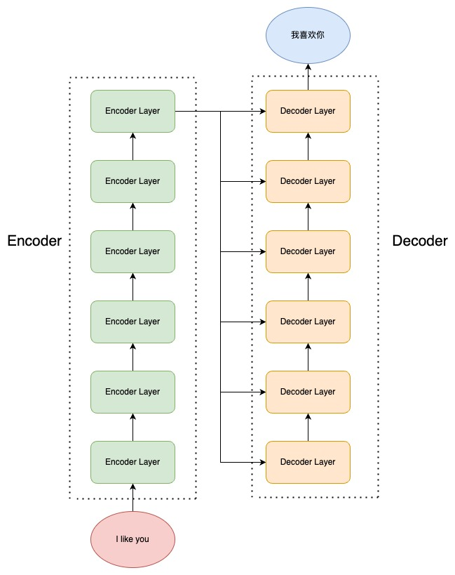
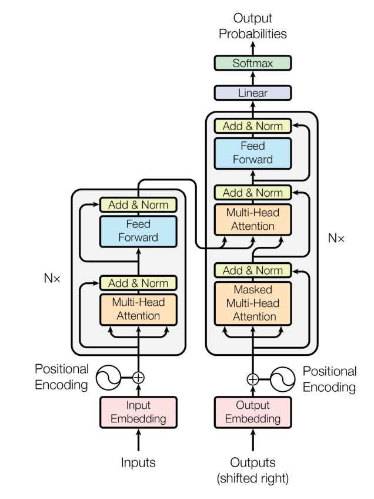

# Transformer架构

## 1. 注意力机制
### 1.1 计算
* 计算过程：Query($Q$), Key($K$). Value($V$)
  * 1. 计算注意力得分：点积求相似度后softmax归一化到0-1之间
  $score = softmax(QK^T)$ 
  where  $softmax(x_i) = \frac{e^{x_i}}{\sum_je^{x_j}}$
  * 2. 对$V$使用注意力得分加权求和，作为最终输出
    $attention(Q, K, V) = softmax(QK^T)V$
  * 3. 在输出中，**要除以$\sqrt{d_k}$，降低softmax的点积的输入量级，避免梯度消失或爆炸**。
    **$attention(Q, K, V) = softmax(\frac{QK^T}{\sqrt{d_k}})V$**
    这是因为，随着$d_k$增大，点积的量级也会持续增大。对于softmax，会将接近于1的值分配给点积的最大值，将接近于0分配给其他值（softmax使用了指数函数），而当softmax的输入量级非常大时，softmax的计算结果接近0或1，此时softmax函数的雅可比矩阵的对角线元素会出现0。而通过softmax的反向传播等价于Loss对softmax输出求偏导再乘以雅可比急诊，而此时雅可比急诊行列式收敛到0.因此梯度出现消失

```python
def attention(query, key, value, dropout = None):
    # 输入维度：(batchsize, seq_len, d_k)，其中d_k相当于序列每个元素被编码成向量的维度
    # 获取维度，Q V维度相同
    d_k = query.size(-1)
    # 矩阵相乘torch.matmul；对应元素相乘torch.mul
    # transpose(input, dim0, dim1)将两个维度交换
    socres = torch.matmul(query, key.transpose(-2, -1))/math.sqrt(d_k)
    # socres的维度是(batch_size, seq_len_q, seq_len_k)
    # 对于每个查询，它对应的所有键Key的分数需要归一化，因此需要在-1维度中做softmax
    p_attn = scores.softmax(dim = -1)
    if dropout is not Node:
        p_attn = dropout(p_attn)
    return torch.matmul(p_attn, value), p_attn
```

### 1.2 自注意力机制与掩码自注意力
* **自注意力 self-attention**，即是计算**本身序列**中每个元素对其他元素的注意力分布，即在计算过程中，Q、K、V 都由同一个输入通过不同的参数矩阵计算得到。
* **掩码自注意力 Mask Self-Attention** 掩码自注意力会生成一串掩码，来遮蔽未来信息，防止模型关注 “未来位置的 token”。模型需要每一个样本根据未被遮蔽的 token 来预测下一个 token 。
  例如模型的输入是：
  ```
    <BOS> 【MASK】【MASK】【MASK】【MASK】
    <BOS>    I   【MASK】 【MASK】【MASK】
    <BOS>    I     like  【MASK】【MASK】
    <BOS>    I     like    you  【MASK】
    <BOS>    I     like    you   </EOS>
  ```
  因此，我们可以构建一个与序列等长的上三角矩阵作为掩码。
  ```python
  # 假设输入维度（batch_size, seq_len, hidden_size）
  # 先创建一个方阵，1*seq_len*seq_len，所有元素是-inf
  # max_seq_len 是预先设定的最长序列长度，可以根据这一参数进行截断、填充等
  mask = torch.full(1, args.max_seq_len, args.max_seq_len).float("-inf")
  # torch.triu: 提取上三角矩阵
  # diagonal=1：保留主对角线以上第一条对角线及以上的元素，主对角线及以下的元素置为 0。
  mask = torch.triu(mask, diagnoal = 1)
  ```
  在注意力计算时，先用所有数据计算注意力分数，然后用注意力得分与该掩码矩阵求和，再进行softmax。这样，所有上三角的注意力得分都是-inf，经过softmax会变成0。
  ```python
  # 当前实际序列长度seqlen，可能小于max_seq_len
  scores = scores + mask[:, :seqlen, :seqlen]
  # 可能xq是预先定义的device上的计算数据类型，保持与device一致
  scores = softmax(scores.float(), dim = -1).type_as(xq)
    ```


### 1.3 多头注意力
**多头注意力机制（Multi-Head Attention）** 是指同时对一个语料进行**多次注意力计算**，每次注意力计算都能拟合不同的关系，将最后的多次结果拼接起来作为最后的输出
    $MultiHead(Q, K, V) = Concat(head_1, ..., head_h)W^O$
    where $head_i = Attention(QW_i^Q, KW_i^K, VW_i^V)$

```python 
import torch.nn as nn
import torch


'''多头注意力计算'''
class MultiHeadAttention(nn.Module):
    # nn.Module 是 PyTorch 中所有神经网络模块的基类
    # 自定义的神经网络层必须继承它

    def __init__(self, args:ModelArgs, is_causal = False):
        # 构造函数
        super.__init__()
        # 隐层维度必须是头数的整数倍，相当于每一个头负责一部分的隐层维度
        # assert 是 Python 的断言语句，语法为 assert [条件, 错误信息（可选）]，当条件为False时提前终止程序
        assert args.dim % args.n_heads == 0
        self.head_dim = args.dim // args.n_heads
        self.n_heads = args.n_heads

        # 初始化参数矩阵
        # Wq, Wk, Wv 参数矩阵，每个参数矩阵为 n_embd x dim
        # 本质是三个可学习的投影矩阵，它们的作用是将原始输入分别映射到 “查询空间”“键空间”“值空间”。并包含可学习的参数，提升模型表达能力

        # 注意力机制的核心是学习序列中元素的相对关系，而非绝对数值。
        # 偏置项作为常数，会给所有样本 / 位置添加相同的偏移，这对捕捉 “相对关系” 没有帮助，还会增加参数量
        # 因此在线性层不添加偏置项，降低过拟合

        self.wq = nn.Linear(args.n_embd, self.n_heads * self.head_dim, bias = False)
        self.wk = nn.Linear(args.n_embd, self.n_heads * self.head_sim, bias = False)
        self.wk = nn.Linear(args.n_embd, self.n_heads * self.head_sim, bias = False)

        # 输出权重矩阵，维度是dim*dim
        self.wo = nn.Linear(self.n_heads*self.head_dim, args.dim, bias = False)

        # 注意力的dropout
        self.attn_dropout = nn.Dropout(args.dropout)
        # 残差链接的dropout
        self.resid_dropout = nn.Dropout(args.dropout)
        self.is_causal = is_causal

        # 用于掩码的上三角矩阵
        # 这里因为是多头，需要多定义一个维度
        if self.is_causal:
            mask = torch.full((1, 1, args.max_seq_len, args.max_seq_len), float("-inf"))
            mask = torch.triu(mask, diagonal = -1)
            # 缓冲区（buffer）是指模型中需要长期保存但不需要被优化器更新的张量（非可学习参数）
            # 这里的mask是固定的掩码矩阵，需要加入缓冲区，否则加载模型、移动到gpu上时可能丢失
            self.register_buffer("mask", mask)
    
    def forward(self, q:torch.Tensor, k:torch.Tensor, v:torch.Tensor):
        # 首先获取batch_size, seq_len, dim
        bsz, seqlen, _ = q.shape

        # 计算Q K V，通过参数层。 最终的维度 batch_size, seq_len, dim
        xq, xk, xv = self.wq(q), self.wk(k), self.wv(v)

        # 首先，将特征向量拆分成多头，让每个子向量对应一个头。变成 batch_size, seq_len, n_head, dim // n_heads 
       
        # torch.view可以重新调整向量的形状（参数是目标维度尺寸）
        # view 操作必须遵循内存连续性，即bs->seqlen->dk，只能在现有维度的基础上 “重新划分” 维度。因此为了高效计算，只能拆分最后两个维度。而不能改变维度顺序
        xq = xq.view(bsz, seqlen, self.n_heads, self.head_dim)
        xk = xk.view(bsz, seqlen, self.n_heads, self.head_dim)
        xv = xv.view(bsz, seqlen, self.n_heads, self.head_dim)

        # 然后翻转维度，变成batch_size, n_heads, seq_len, dim//n_heads，代表每个batch都用多个头处理，每个头都能对应(seq_len, d_k)的矩阵，方便进行矩阵运算
        # 用transpose指定第二个和第三个维度互换
        # transpose 只能交换已有维度的位置，不能拆分。即先用view拆分，再用transpose调整顺序
        xq = xq.transpose(1, 2)
        xk = xk.transpose(1, 2)
        xv = xv.transpose(1, 2)

        # 注意力计算
        # scores的维度是 Batch_size, n_heads, seq_len(q), seq_len(k)
        scores = torch.matmul(xq, xk.transpose(-1, -2))/math.sqrt(self.head_dim)
        # 掩码
        if self.is_casual:
            # hasattr是Python的内置函数，用于检查对应是否有对应属性
            # 注意，虽然没有显式写 self.mask = mask，但通过放入缓冲区，已经间接为 self 绑定了 mask 属性
            assert hasattr(self, 'mask')
            scores = scores + self.mask[:, :seqlen, :seqlen]
        
        # 要指定dim = -1，因为要让查询位置 i 对所有键位置的注意力权重之和为 1，这样才能对V进行加权平均
        scores = F.softmax(scores.float(), dim = -1).type_as(xq)
        # dropout
        scores = self.attn_dropout(scores)
        # 注意力得分计算完成最终加权平均
        # (B, n_h, seq_len, seq_len) * (B, n_h, seq_len, d_k) -> (B, n_h, seq_len, d_k)还是原先的维度
        output = torch.matmul(scores, xv)

        # 合并多头结果
        #  先交换维度为 (B, T, n_head, dim // n_head)，再拼接成 (B, T, n_head * dim // n_head)
        # contiguous 函数用于重新开辟一块新内存存储，因为Pytorch设置先transpose再view会报错
        # 因为view直接基于底层存储得到，然而transpose并不会改变底层存储，因此需要额外存储
        output = output.transpose(1, 2).contiguous().view(bsz, seq_len, -1)

        # 投影回残差。以线性变换融合多头特征，而不是简单拼接。
        output = self.wo(output)
        output = self.resid_dropout(output)

        return output
```

## 2. Encoder-Decoder

### 2.1 Seq2Seq模型
* Seq2Seq，即序列到序列，是一种经典 NLP 任务。具体而言，是指模型输入的是一个自然语言序列input，输出的是一个可能不等长的自然语言序列output。Seq2Seq是NLP中最经典的任务，几乎所有的 NLP 任务都可以视为 Seq2Seq 任务。例如文本分类任务，可以视为输出长度为 1 的目标序列

Transformer由Encoder Decoder组成，每个Encoder Decoder包含多个块

### 2.2 Transformer块
#### 2.2.1. 前馈神经网络FNN

```python
class MLP(nn.Module):
    def __init__(self, dim:int, hidden_dim:int, dropout:float):
        super().__init__()

        # FFN由两层线性层和一个dropout层组成
        # 使用ReLu激活函数
        # 先映到隐层，再映回来
        self.w1 = nn.Linear(dim, hidden_dim, bias = False)
        
        self.w2 = nn.Linear(hidden_dim, dim, bias = False)
        self.dropout = nn.Dropout(dropout)
    
    def forward(self, x):
        return self.dropout(self.w2(nn.ReLu((self.w1(x)))))
```

#### 2.2.2. 层归一化Layer Norm
归一化核心是为了让不同层输入的取值范围或者分布能够比较一致。
**关于BN和LN**
* Batch Norm：对**每个批次**的数据进行归一化，均值为0，方差为1。同时为了不强制要求标准化，有时还可引入两个可学习参数$\gamma$（缩放）和$\beta$（偏移）
  $x_i^{bn} = \frac{x_i-\mu_B}{\sqrt{\sigma_B^2+\epsilon}}$
  $y_i = \gamma\dot{x_i^{bn}}+\beta$
在训练阶段，均值和方差都是在批次内计算得到的，同时维护均值和方差的平均值。推理时，使用维护的平均参数进行归一化。
适用情形：输入特征在批次内有稳定分布，但不适合动态长度的序列数据（如文本，不同样本序列长度不同，批次内分布不稳定）

* Layer Norm：对**单个样本的所有特征**维度进行归一化，不依赖批次，仅利用当前样本的信息。归一化计算与BN一致，对当前样本的所有特征维度计算均值和方差。不过当推理时，由于LN本身即应用在单个样本，因此推理逻辑与训练相同，无需维护统计量。
适用情形：适用于批次大小小、序列长度动态变化的场景。
相较于BN的优点：不需每步存储batch统计量，减少存储需求。对于文本数据，不同句子的分布不同，BN失去意义。且若测试集出现长度更长的句子，由训练集得到的BN相关统计量在相关位置缺失。

```python
class LayerNorm(nn.Module):
    def __init__(self, features, eps = 1e-6):
        super().__init__()

        # a_2, b_2两个可学习的参数
        # 用于在标准化后对特征进行 “缩放” 和 “偏移”，让模型自主学习最适合的分布，而非强制固定为均值 0、方差 1。
        self.a_2 = nn.Parameter(torch.ones(featuers))
        self.b_2 = nn.Parameter(torch.zeros(features))
        self.eps = eps

    def forward(self, x):
        # 在特征维度中做均值，mean: (bsz, max_len, 1)
        mean = x.mean(-1, keepdim = True)
        std = x.std(-1, keepdim = True)

        # 在最后一个维度广播
        # x: (bsz, max_len, features), mean:(bsz, max_len, 1)，计算时python会自动广播，后面同理。
        return self.a_2 * (x-mean) / (std+self.eps) + self.b_2
```

#### 2.2.3 残差连接
​为了避免模型退化，Transformer 采用了残差连接的思想来连接每一个子层。残差连接，即下一层的输入不仅是上一层的输出，还包括上一层的输入。残差连接允许最底层信息直接传到最高层，让高层专注于残差的学习。

在Encoder中，每一个transformer块，输入进入多头自注意力层的同时会直接传递到该层的输出，然后该层的输出会与原输入相加，再进行标准化。
$x = x + MultiHeadSelfAttention(LayerNorm(x))$
$output = x + FNN(LayerNorm(x))$

```python
# 直接在forward中实现
# 第一个残差链接在注意力机制计算完成后
h = x + self.attention.forward(self.attention_norm(x))
# 第二个在FFN计算完成后
out = h + self.feed_forward.forward(self.fnn(norm(h)))

```

### 2.3 Encoder
每个Encoder Layer包含一个注意力层+一个FFN
```python
class EncoderLayer(nn.Module):
    '''Encoder层：多头自注意力+FFN，两个残差链接'''
    def __init__(self, args):
        super().__init__()
        # 一个LN在Attention之前，一个在MLP之前
        self.attention_norm = LayerNorm(args.n_embd)
        self.attention = MultiHeadAttention(args, is_causal = False)
        self.fnn_norm = LayerNorm(args.n_embd)
        self.feed_forward = MLP(args.n_embd, args.dim, args.dropout)

    def forward(self, x):
        # Layer Norm
        norm_x = self.attention_norm(x)
        # 自注意力+残差链接
        h = x +  self.attention.forward(norm_x, norm_x, norm_x)
        # FFN+残差链接
        out = h + self.feed_forward.forward(self.ffn_norm(h))

        return out

class Encoder(nn.Module):
    # Encoder由N个Encoder Layer构成
    def __init__(self, args):
        super().__init__()
        self.layers = nn.ModuleList([EncoderLayer(args) for _ in range(args.n_layer)])
        self.norm = LayerNorm(args.n_embd)
    def forward(self, x):
        for layer in self.layers:
            x = layer(x)
        return self.norm(x)
```
### 2.4 Decoder
Decoder Layer与Encoder Layer存在一些不同。首先，每个Decoder Layer是由两个多头注意力机制得到的。第一个注意力层是一个掩码自注意力层，即使用 Mask 的注意力计算，保证每一个 token 只能使用该 token 之前的注意力分数；第二层注意力层是多头注意力层，用第一个注意力层的输出作为Q，用Encoder的输出作为K V


```python
class DecoderLayer(nn.Module):
    def __init__(self, args):
        super().__init__()
        self.attentiion_norm_1 = LayerNorm(args.n_embd)
        # 第一个，掩码注意力层
        self.mask_attention = MultiHeadAttention(args, is_causal = True)

        self.attention_norm_2 = LayerNorm(args.n_embd)
        self.attention = MultiHeadAttention(args, is_causal = False)

        # FFN
        self.ffn_norm = LayerNorm(args.n_embd)
        self.feed_forward = MLP(args.embd, args.dim, args.dropout)
    
    def forward(self, x, enc_out):
        # LayerNorm
        norm_x = self.attention_norm_1(x)
        # 掩码自注意力
        x = x + self.mask_attention.forward(norm_x, norm_x, norm_x)
        # 多头自注意力
        norm_x = self.attention_norm_2(x)
        h = x + self.attention.forward(norm_x, enc_out, enc_out)
        # 前馈
        out = h + self.feed_forward.forward(self.ffn_norm(h))
        return out

class Decoder(nn.Module):
    def __init__(self, args):
        super().__init__()
        self.layers = nn.ModuleList([DecoderLayers(args) for _ in args.n_layer])
        self.norm = LayerNorm(args.n_embd)

    def forward(self, x, enc_out):
        for layer in self.layers:
            x = layer(x, enc_out)
        return self.norm(x)
```
## 3. 搭建完整Transformer
### 3.1 Embedding层

Embedding层是将分词后的自然语言的输入转化为机器可以处理的向量，输入维度通常的`(batch_size, seq_len, 1)`，其中`seq_len`是自然语言序列的长度，第三个维度则是 token 经过 tokenizer 转化成的 index 值。
而 Embedding 内部其实是一个可训练的`(Vocab_size，embedding_dim)`的权重矩阵，词表里的每一个值，都对应一行维度为 embedding_dim 的向量。对于输入的值，会对应到这个词向量，然后拼接成`(batch_size，seq_len，embedding_dim)`的矩阵输出。

直接使用Embedding层实现
```python
self.tok_embeddings = nn.Embedding(args.vocab_size, args.dim)
```

### 3.2 位置编码
​位置编码，即根据序列中 token 的相对位置对其进行编码，再将位置编码加入词向量编码中。位置编码的方式有很多，Transformer 使用了正余弦函数来进行位置编码，对于奇数位置的 token 和偶数位置的 token，Transformer 采用了不同的函数进行编码。
$$
\begin{aligned}
PE(pos, 2i) &= \sin\left(pos / 10000^{2i/d_{\text{model}}}\right) \\
PE(pos, 2i+1) &= \cos\left(pos / 10000^{2i/d_{\text{model}}}\right)
\end{aligned}
$$
​上式中，pos 为 token 在句子中的位置，2i 和 2i+1 则是指示了 token 是奇数位置还是偶数位置。

### 3.3 完整的Transformer结构
目前 LLM 一般采用“Pre-Norm”结构（可以使 loss 更稳定），本文在实现时采用“Pre-Norm”结构。
经过 tokenizer 映射后的输出先经过 Embedding 层和 Positional Embedding 层编码，然后进入上一节讲过的 N 个 Encoder 和 N 个 Decoder（在 Transformer 原模型中，N 取为6），最后经过一个线性层和一个 Softmax 层就得到了最终输出。


```python
class Transformer(nn.Module):
    def __init__(self, args):
        super().__init__()

        # 必须输入词表大小和 block size
        assert args.vocab_size is not None
        assert args.block_size is not None
        self.args = args

        # 整体结构
        self.transformer = nn.ModuleDict(dict(
            wte = nn.Embedding(args.vocab_size, args.n_embd),
            wpe = PositionalENcoding(args),
            drop = nn.Dropout(args.dropout)
            encoder = Encoder(args)
            decoder = Decoder(args),
        ))

        # 最后输出的线性层（映射回原来维度）和softmax
        self.lm_head = nn.Linear(args.n_embd, args.vocab_size, bias = False)
        # 初始化所有模型权重
        # apply 是 nn.Module 提供的一个内置方法，功能是：递归地对当前模块（self）及其所有子模块（如 self.layers、self.attention 等）应用传入的函数。
        self.apply(self.__init_weights)

        # 查看所有参数的数量
        print("number of parameters: %.2fM" % (self.get_num_params()/1e6,))

    def get_num_params(self, non_embedding = False):
        # non_embedding: 是否统计 embedding 的参数
        # .numel()用于返回张量中元素的总数量
        n_params = sum(p.numel() for p in self.parameters())
        # 如果不统计 embedding 的参数，就减去
        if non_embedding:
            n_params -= self.transformer.wte.weight.numel()
        return n_params

    def _init_weights(self, module):
        # 线性层和Embedding层初始化为正则分布
        if isinstance(module, nn.Linear):
            torch.nn.init.normal_(module.weight, mean = 0.0, std=0.02)
            if module.bias is not None:
                torch.nn.init.zeros_(module.bias)
        elif isinstance(module, nn.Embedding):
            torch.nn.init.normal_(module.weight, mean = 0.0, std = 0.02)
    
    def forward(self, idx, targets = None):
        # 输入为 idx，维度为 (batch size, sequence length, 1)；targets 为目标序列，用于计算 loss
        device = idx.device
        b, t = idx.size()
        assert t <= self.args.block_size, f"不能计算该序列，该序列长度为 {t}, 最大序列长度只有 {self.args.block_size}"

        # 通过self.transformer
        # 首先是Embedding和位置编码，得到(batch_size, seq_len, n_embd)
        print("idx", idx.size())
        tok_embd = self.transformer.wte(idx)
        pos_embd = self.transformer.wpe(tok_embd)
        
        # Dropout
        x = self.transformer.drop(pos_embd)
        # Encoder
        enc_out = self.transformer.encoder(x)
        # Decoder
        x = self.transformer.decoder(x, enc_out)

        if targets is not None:
            logits = self.lm_head(x)
            loss = F.cross_entropy(logits.view(-1, logits.size(-1)), targets.view(-1), ignore_index=-1)
        else:
            # 推理阶段，我们只需要 logits，loss 为 None
            # 取 -1 是只取序列中的最后一个作为输出
            logits = self.lm_head(x[:, [-1], :]) # note: using list [-1] to preserve the time dim
            loss = None

        return logits, loss


```