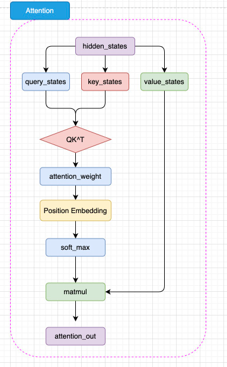
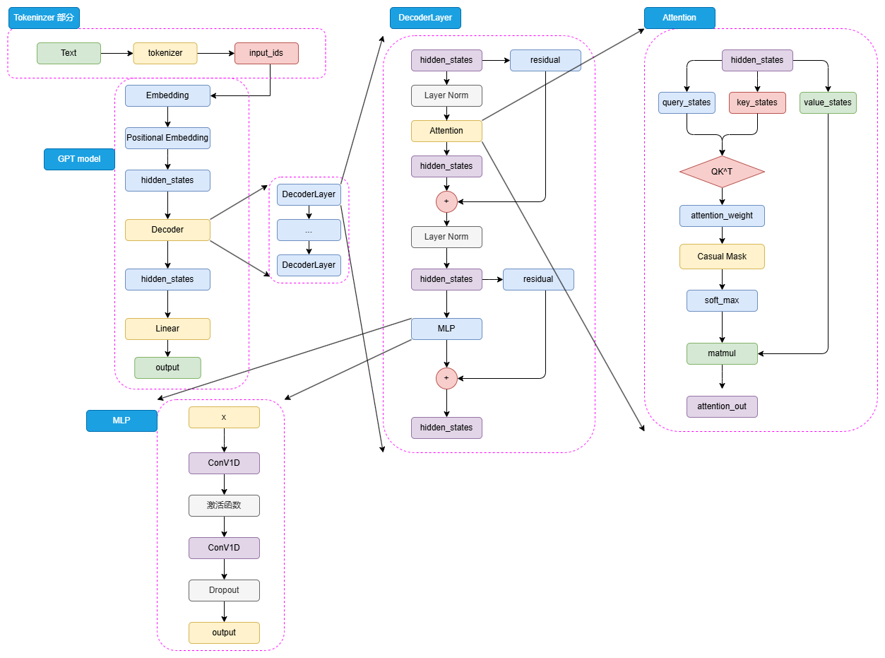

2025/10/22

# 预训练语言模型
## Encoder-only PLM

### BERT
* BERT取了Transformer的Encoder部分，使用多个Encoder堆叠而成，本质也是Seq2Seq模型。没有使用Decoder，而是在最顶层 添加了Prediction head。
* 整体模型：Embedding, Encoder, Prediction heads
  
**Embedding**
输入的文本序列会首先通过 tokenizer（分词器） 转化成 input_ids（大部分的LLM分词阶段都相似），然后进入 Embedding 层转化为特定维度的 hidden_states

**Encoder Layer (Attention)**
相较于Transformer的子注意力机制，BERT 将相对位置编码融合在了注意力机制中，将相对位置编码同样视为可训练的权重参数。即在计算完注意力分数后，通过一层线性矩阵Position Embedding，通过可训练的参数来拟合相对位置。

**Prediction Head**
* BERT的预测头是分类头，用来进行分类，经过线性层与激活函数，得到了最后的类别概率，经过 Softmax 计算就可以计算出模型预测的类别。
* 这里注意到，BERT使用的激活函数是**GELU**函数，全名为高斯误差线性单元激活函数。GELU的设计灵感来源于高斯分布的累积分布函数（CDF），旨在解决传统激活函数（如ReLU）的一些局限性，例如“死亡ReLU”问题（负输入被完全抑制，导致梯度为零）和非平滑性，从而提升模型的训练稳定性和性能。
* GELU的原始思想是输入乘以高斯分布的累积分布函数
$GELLU(x) = x * \Phi(x), x~N(0,1)$
对于N(0, 1)分布，几乎当$x>3$时，$\phi(x) \approx1$，则当x较大时，GULU近似线性分布。而当x为负时，$\phi(x)$取值很小，则此时允许GELU输出非零的小值（而非像 ReLU 那样直接输出 0），即 “小幅泄露”，避免了ReLU的直接截断，因此避免了梯度为0

为了避免积分操作，现在多采用GELU的近似计算，公式如下
$GELU(x) = 0.5x(1+\tanh(\sqrt{\frac{2}{\pi}})(x+0.044715x^3))$

**预训练任务——MLM + NSP**
BERT 更大的创新点在于其提出的两个新的预训练任务上——MLM（Masked Language Model，掩码语言模型） 和 NSP（Next Sentence Prediction，下一句预测）。
* MLM:在一个文本序列中随机遮蔽部分 token，然后将所有未被遮蔽的 token 输入模型，要求模型根据输入预测被遮蔽的 token。由于模型可以利用被遮蔽的 token 的上文和下文一起理解语义来预测被遮蔽的 token，因此通过这样的任务，模型可以拟合双向语义.
* NSP:NSP 任务的核心思路是要求模型判断一个句对的两个句子是否是连续的上下文。例如，输入和输入可以是：
  
**微调**
* 预训练得到的强大能力能否通过低成本的微调快速迁移到对应的下游任务上。
* 对每一个输入的文本序列，BERT 会在其首部加入一个特殊 token <CLS>。在后续编码中，该 token 代表的即是整句的状态，也就是句级的语义表征。
* 在完成预训练后，针对每一个下游任务，只需要使用一定量的全监督人工标注数据，对预训练的 BERT 在该任务上进行微调即可。

## Encoder-Decoder PLM

### T5
T5 则采用了 Encoder-Decoder 结构，其中编码器和解码器都是基于 Transformer 架构设计。编码器用于处理输入文本，解码器用于生成输出文本。编码器和解码器之间通过注意力机制进行信息交互，从而实现输入文本到输出文本的转换。

T5模型的一个核心理念是“大一统思想”，即所有的 NLP 任务都可以统一为文本到文本的任务，这一思想在自然语言处理领域具有深远的影响。其设计理念是将所有不同类型的NLP任务（如文本分类、翻译、文本生成、问答等）转换为一个统一的格式：输入和输出都是纯文本。

## Deccoder-Only PLM
目前所有的 LLM 基本都是 Decoder-Only 模型。而引发 LLM 热潮的 ChatGPT，正是 Decoder-Only 系列的代表模型 GPT 系列模型的大成之作。**Decoder-only的模型更适合文本生成**

### GPT

* 输入的 input_ids 首先通过 Embedding 层，再经过 Positional Embedding 进行位置编码。不同于 BERT 选择了可训练的全连接层作为位置编码，GPT 沿用了 Transformer 的经典 Sinusoidal 位置编码，即通过三角函数进行绝对位置编码
* 由于不再有 Encoder 的编码输入，Decoder 层仅保留了一个带掩码的注意力层，并且将 LayerNorm 层从 Transformer 的注意力层之后提到了注意力层之前。（更像Encoder）并且在计算得到注意力权重之后，通过掩码矩阵来遮蔽了未来 token 的注意力权重。
* 预训练任务——CLM。因果语言模型，Casual Language Model，下简称 CLM。CLM 则是基于一个自然语言序列的前面所有 token 来预测下一个 token，通过不断重复该过程来实现目标文本序列的生成。

### LLaMA
* LLaMA模型的整体结构与GPT系列模型类似，只是在模型规模和预训练数据集上有所不同。