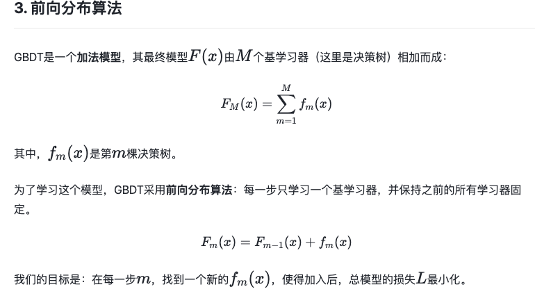

# 问题描述：


# 数据集与预处理

从原始给定的数据集中，划分得到训练集与测试集（测试集是过去一周内的交互记录，训练集是更远前的。测试集不是真正的上交比赛结果时的得分）
* **训练集**：数据规模(8380130, 4)，八百万条数据左右。包含四列信息：会话（session），物品id(aid)，交互时间（ts），交互类型（type）
* **测试集**：数据规模(377192, 4)
* **pair_df**：对每个物品 aid_idx，提取其后续 1-4 步内交互的物品（next_aid_idx），并计算时间差（ts_diff）。数据规模(28039892, 3)，三列：aid_idx ┆ next_aid_idx ┆ ts_diff 
  
这里，本地验证集比竞赛测试集容易预测：很自然，竞赛测试集可能包含更长时间后的行为，或用户分布、物品流行度有更大变化。

**评估指标**：加权召回率，先汇总所有会话的命中总数和目标总数，再计算整体比例（全量命中数 / 全量目标数），加权系数（点击 0.1、加购 0.3、下单 0.6）反映了业务优先级。

**映射为整数索引**：1. **降低内存占用，提升存储效率**。原始id非连续，可能很大，映射为连续索引后更小的数据类型存储（例如 Int32 甚至 Int16），大幅减少内存占用。 2. **适配Embedding层的输入**。嵌入层可以理解为一个权重矩阵，若输入是连续索引，“查表” 可通过数组下标直接访问（matrix[i]），时间复杂度为O(1)，效率极高。若输入是非连续的原始 ID，则需要先通过哈希表将 ID 映射到连续索引，再查表。

# 召回
## LastInter
在测试集中，找到用户交互过的n个物品，得分是根据交互的次数。适用于捕捉用户的 “即时兴趣”。对每个交互类别，分别找到该交互类别下的交互过次数很高的物品，作为推荐。

**输出得分**：交互次数，int

**存在的问题**：没有衡量时间的远近，可能返回时间很久前的物品，且可能出现重复。

**可能的改进**：先取会话中的最近N次交互，然后再按照交互次数排序（训练集中，每个session的每个交互类型数量只有几十个）。或者将得分设计为 “时间衰减型”（如最近的物品得分 = 20，前一次 = 19，…，第 20 次 = 1）

## Item CF

**基本思想**：首先计算物品间的相似度（共同被多少用户交互过、同一个物品对在不同session中的得分不同），对目标用户，找到其历史的交互物品，然后推荐最相似物品。

❗️这里区分了源行为与目标行为，aid来自源行为类型，aid_right来自目标行为类型
**计算相似性**：
  * 对于每一个物品对在每一个session中，计算一个权重。该权重是多项的乘积，包括：
    * 1.  物品流行度惩罚（item_count_coef），降低 “热门物品对” 的权重。利用两个物品在所有session中出现次数计算得到。
    ``item_count_coef = 1.0 / log(sqrt(counts × counts_right + 2)) ``

    * 2.  物品时效性系数（trend_coef），提升 “近期交互物品” 的权重，捕捉物品的 “潮流性”。计算被推荐物品与最新时间的时间差（重点关注被推荐物品的新鲜度）
    ``trend-coef = 1.0 / (pl.max("ts") - pl.col("ts-right") + 1)``
    * 3.  时间差衰减系数（ts_diff_coef）提升 “同一会话中时间间隔近的物品对” 的权重。计算两个物品的时间差，在同一个会话中时间相近，则相似度高。
    ``ts-diff-coef = 1 / 2^((pl.col("ts") - pl.col("ts_right")) / 60 / 60)``
    * 4. 会话质量惩罚系数（iif_coef），降低 “长会话中物品对” 的权重。计算本session中的所有交互物品的总数。``iif_coef = 1 / (1 + pl.col("session_aid_count")).log()``
  * 最后，按(aid, aid_right)分组求和，得到物品对的总相似度。（对权重分组求和，当物品对出现次数越多，求和次数也就越多）

  
**方法**
  * 1. **训练阶段**：计算物品相似度。
    * (1) 输入训练集train_df，自连接生成共现对，生成同一session内的所有物品对(aid, aid_right)（即共现物品对）。
    * (2) 计算相似度，最终分组求和，得到总相似度。对于每个物品，只保留top300个相似物品
  * 2. **推理阶段**：生成候选集
    * (1) 只保留训练集指定的行为
    * (2) 对于每个会话中交互过的每个物品，将其与与该物品的相似物品（aid_right）及相似度（weight）关联起来。
    * (3) 同一会话中，可能有多个历史物品同时与某一个物品相似，此时需要聚合预测物品的权重。**提供了多种策略**:均值，求和，最值，仅用最后一个物品
    * (4) 筛选topn，得到候选集。

**关于不同策略的结果** 求和或取最大值效果更好，source_types	target_types都是012（全体数据）最好。不要使用历史数据，仅用先交互数据-未来数据做物品对。ecall@50	在0.56左右。


## Item-MF
**基本思想**（矩阵分解Matrix Factorization, MF）的物品推荐模型（Item MF），核心是通过学习物品的低维嵌入向量（Embedding），捕捉物品间的潜在关联。

**构造训练样本** 
1. 训练数据是 “物品对”（aid_x, aid_y），代表 “用户先交互 aid_x，后交互 aid_y” 的共现关系
2. 对每个物品对（aid_x, aid_y）计算权重 --> **近期共现的非热门物品对权重更高**：包含**时间衰减系数**（时间差越大，系数越小（最长考虑7天），只对原物品计算），**流行度惩罚**（出现次数多则权重低，对两个物品都计算）

流行度惩罚：``1 / log1p(aid_size)`` 温和的惩罚，模型会更关注 “用户与冷门物品的匹配关系”

**模型结构**
* 1. Embedding: 将物品映射到低维空间，得到物品单位表示（嵌入纬度256）
* 2. 前向传播：计算物品对的嵌入表示的内积（代表相似度），同时乘以权重
* 3. 训练过程：**负采样**训练目标是让 “真实共现的物品对（正样本）得分高于随机物品对（负样本）”，使用 **BPR** 损失优化，若正样本得分 > 负样本得分，损失小。
  ``loss = -torch.log(self.gamma + torch.sigmoid(pos_score - neg_score)).mean()``
  * 这里**按物品流行度加权负采样**,让采样概率与物品的流行度（交互次数）成正相关，但通过指数0.75削弱极端热门物品的占比（热门物品的权重增长变慢）。对每个物品的流行度取 0.75 次方作为采样权重（count^0.75），所有物品的权重之和为总权重（total_weight），比例就是采样概率。**完全随机采样（不考虑流行度）会导致大量低频物品被采样**
  * **负样本比例1:3**，不同
* 4. 推理过程：有不同策略：用最后一个物品的嵌入向量，或者是最近物品的加权平均（时间权重线性衰减），作为查询向量。然后利用faiss库实现高效查找。


## User-MF
**基本思想**是通过学习 “用户嵌入向量” 和 “物品嵌入向量”，捕捉用户的个性化偏好

**构造训练样本**训练数据是 “用户 - 物品交互对”（session, aid），代表 “用户（会话）与物品发生过交互”，样本权重通过物品物品流行度修正。

**推理召回**：对测试集中的每个会话，直接使用其对应的用户嵌入向量作为查询向量，然后使用faiss查找

原代码有误：
如果希望进行流行度惩罚，可以传入coef = 1 / np.log1p(aid_size)
```python
# kaggle_otto2/cand_generator/user_mf/model.py
def forward(self, session, aid, aid_size):
        session_emb = self.session_embeddings(session)
        aid_emb = self.aid_embeddings(aid)
        return (session_emb * aid_emb).sum(dim=1) * aid_size # 不应该乘以aid_size，这不是流行度惩罚。直接删掉或者类似User MF，传入1/aid_size有关的coef 
```

## <font color = red> Word2Vec</font>
* **背景**：Word2Vec 是NLP中一种用于学习“词嵌入”（Word Embeddings）的技术，可以将词汇表中的每一个词都表示成一个低维的向量（词向量），这些向量能够蕴含词语的语义信息。
* **Word2Vec基本思想**：通过训练一个语言模型完成与“上下文预测”相关的任务，得到模型训练完后的副产物：模型参数(这里特指神经网络的权重)，并将这些参数作为输入 x 的某种向量化的表示，这个向量便叫做——**词向量**。主要思想是上下文相似的两个词，它们的词向量也应该相似。大致有两种模型：
  * 1. CBOW(Continuous Bag-of-Word)：**以上下文（在window大小内）词汇预测当前词**，即用$w_{t-2}w_{t-2}, w_{t-1}, w_{t+1}, w_{t+2}$这些上下文的词向量，进行平均等操作进行合并，用合并后的向量去预测 $w_{t}$。**CBOW适合大型数据集、高频词**，因为它将多个上下文词合并成一个向量，对于一个中心词，只需要进行一次前向和反向传播，训练更快。并且平均上下文向量的操作使得它对常见词的表示更稳定。
  * 2. SkipGram：以当前词预测其上下文词汇，即用$w_{t}$去预测$w_{t-2}w_{t-2}, w_{t-1}, w_{t+1}, w_{t+2}$。**SkipGram更适合中小型数据集、注重低频词的表示**，因为它为每个 (中心词, 上下文词) 对创建训练样本，能够从有限的数据中提取更多信息（相当于数据增强，并且直接使用中心词（包括罕见词）去预测上下文，使得罕见词的向量也能得到充分的训练和更新（而CBOW容易在平均时抹除低频词的信号）。**但是训练慢**，对于一个中心词和 2 * window 个上下文词，它需要进行 2 * window 次独立的预测和梯度更新计算
  * 3. 如何高效训练？难点在于输出层要对词汇表的每一个词计算softmax，计算量极大
    * (1). Hierarchical Softmax (分层 Softmax)：Softmax 的扁平结构改造成一个二叉树结构（通常是 Huffman 树），词汇表中的每个词对应树上的一个叶子节点。变成二分类的乘积
    * (2). **Negative Sampling (负采样)**：模型不再预测每个词的概率，而是变成了一系列的二分类问题。详细来讲，对于训练样本将其视为正样本，然后从词汇表中随机抽取几个词作为负样本。模型的目标就变成了区分“哪个是正样本，哪些是负样本”，只更新与正样本和选中的负样本相关的权重，而不是更新整个输出层的权重。
*  **OTTO中的word2vec**:
   *  1. **基本思想**：经常一起出现在同一个session的物品，它们的向量会变得更相似。训练word2vec模型，并提供使用 Skip-gram 算法、CBOW算法两种选择，使用负采样进行高效计算。
   *  2. **使用Skip-gram算法**，对低频物品更好

<font color=red>代码中的错误</font>
读入参数时设置错误
```python
# 应该从item2vec里读入
self.lr = self.config.yaml.cg.user_mf.get("lr", 0.1)
# Word2Vec 的“上下文窗口”大小，例如会考虑前面5个和后面5个物品
self.window = self.config.yaml.cg.user_mf.get("window", 5)
# sg ==1: 使用 Skip-gram 算法，对低频物品更好；sg == 0:CBOW
self.sg = self.config.yaml.cg.user_mf.get("sg", 1)
# 负采样时的采样个数
self.negative = self.config.yaml.cg.user_mf.get("negative", 20)
# 忽略出现次数低于阈值的物品
self.min_count = self.config.yaml.cg.user_mf.get("min_count", 1)
self.user_min_inters = self.config.yaml.cg.user_mf.get("user_min_inters", 20)
self.gen_cand_topk = self.config.yaml.cg.user_mf.get("gen_cand_topk", 40)
```


## 候选集合并
在合并不同召回方法的结果时，不直接相加原始得分（避免量级大的方法主导），而是用 “**是否被该方法推荐”（0/1）乘以方法权重**，避免方法评分量级占主导。其中，

代码功能重复
```python

with TimeUtil.timer("prepare data"):
            if seed_type == "seq":
                # 使用最近的k个物品的aid -> 得到对应的整数索引 -> 得到对应的词向量 -> 加权平均作为查询向量
                weights = np.linspace(1.0, 0.2, 17)
                k = len(weights)
                with TimeUtil.timer("get test_aids"):
                    # test sessionごとにitemのlistを取得
                    test_aids_df = (
                        self.data_loader.get_test_df()
                        .sort(["session", "ts"], reverse=[False, True])
                        .with_columns(
                            pl.col("aid")
                            .apply(lambda x: aid2idx[x]) # 转换为整数索引
                            .cast(pl.Int32)
                            .alias("aid_idx")
                        )
                        # 像是代码重复，不需要
                        .join(self.data_loader.get_aid_idx_df(), on="aid")
                        .groupby("session")
                        .agg(pl.col("aid_idx"))
                    )
```

# 特征工程
**Item侧**：
  1. 计算每个物品 (aid) 在最近不同时间窗口内，被交互的总次数，反应流行程度
  2. 每个物品 (aid) 在最近不同时间窗口内，根据其交互次数（点击、加购、购买等）所获得的全局排名
  3. 计算每个物品的交互时间的指标（平均、最大、最小等）（进行了归一化）
  4. 每个物品 (aid) 在同一个会话 (session) 中被“重复”交互（点击、加购、购买等）的概率
  5. 计算每个物品 (aid) 在最近不同时间窗口内，从一种交互类型“转化”到另一种交互类型的概率
**User侧**：
  1. 计算每个用户 (session) 的首次和最后一次交互事件分别发生在星期几
  2. 每个用户 (session) 在测试集 (test_df) 中发生的各种类型交互的总次数
  3. 计算每个用户 (session) 在其交互序列中，连续两次交互之间的时间差的统计特征
  4. 计算每个用户 (session) 进行交互平均发生在一天中的哪个小时
  5. 每个用户 (session) 的交互时间戳 (ts) 的各种统计指标
**交互侧**
  1. 对于每个用户 (session) 和物品 (aid) 的组合，该物品的首次、最后一次交互在该用户会话中的“顺序排名”是多少。
  2. 与该物品的交互是否是在session中的第一次/最后一次同类型交互


# 排序
为每一种交互行为训练一个模型。
## LightGBM

* **GBDT**
  * GBDT (Gradient Boosting Decision Trees - 梯度提升决策树)是一种基于boosting集成学习思想的加法模型，每次迭代都学习一棵CART树来拟合之前 t-1 棵树的预测结果与训练样本真实值的残差。
  * 更进一步的，将这个“拟合残差”的思想，推广到了任意可微的损失函数上，即“拟合负梯度” ，**用负梯度近似模拟残差**。当损失函数是平方误差时，负梯度就是残差。
  GBDT是一个加法模型，其最终模型由M个基学习器（这里是决策树）相加而成

  * 为了学习这个模型，GBDT采用前向分布算法：每一步只学习一个基学习器，并保持之前的所有学习器固定。为了在函数空间中执行梯度下降，我们需要计算损失函数关于函数F的梯度‘
  
* **LightGBM**是GBDT的一种高效实现，显著提升了训练速度。
    * 主要策略：
    * 1. 梯度单边采样。它发现梯度小的样本（模型已经预测得比较准的）对信息增益贡献较小，因此在构建新树时，它会保留所有梯度大的样本（难样本），并随机采样一部分梯度小的样本，从而在不损失太多精度的情况下减少计算量。
    * 2. Leaf-wise Growth (带深度限制): 按叶子节点生长。传统 GBDT 按层(level-wise)生长树，效率较低（在同一层的所有叶子节点中寻找最佳分裂点，完成这一层所有节点的分裂后，再进入下一层）。LightGBM 默认按叶子(leaf-wise)生长，每次选择能带来最大分裂增益的叶子节点进行分裂，（而是每次都从当前所有叶子节点中，找到那个分裂后能带来最大收益（损失降低最多）的叶子节点进行分裂。）可以更快地降低损失，但需要配合 max_depth 防止过拟合。
    * 3. 基于Histogram的决策树算法。将连续的数据数据离散化为整数，将大规模的数据放在了直方图中。因此只保存特征离散化后的值，内存占用减小。遍历特征值时需要遍历的数据量也更少。（离散化影响精度吗？决策树本来就是弱模型，分割点是不是精确并不是太重要；较粗的分割点也有正则化的效果，可以有效地防止过拟合）
* **学习排序**(Learning to Rank - LTR)，训练模型来对列表 (List) 中的项目 (Items) 进行排序。LTR 任务通常使用专门的排序指标来评估，例如：
  * NDCG (Normalized Discounted Cumulative Gain)：关注排名靠前的相关项目，并对靠前的相关项目给予更高权重。是 LTR 最常用的指标之一。
  * LambdaRank:不直接定义损失函数，而是定义了损失函数的梯度 (Lambda Gradient)。这个梯度的大小与交换一对物品 $(d_i, d_j)$ 会对最终排序指标（如 NDCG）造成多大影响 $(\Delta NDCG_{ij})$ 成正比。通过让 GBDT 拟合这些梯度，模型被引导着去优化 NDCG 指标。

## XGBOOST

* **XGBOOST**基于预排序方法的决策树算法。
  * 首先，对所有特征都按照特征的数值进行预排序。其次，在遍历分割点的时候用的代价找到一个特征上的最好分割点。最后，在找到一个特征的最好分割点后，将数据分裂成左右子节点。
  * 缺点：空间消耗大。这样的算法需要保存数据的特征值，还保存了特征排序的结果。在遍历每一个分割点的时候，都需要进行分裂增益的计算，消耗的代价大。

## Catboost
CatBoost 采用的**对称树结构**（Symmetric Trees） 之所以能减少过拟合风险，核心原因是其强制**限制了决策树的复杂度和生长方式**，避免模型过度学习训练数据中的噪声细节。**叶子深度严格相等，同一层所有节点共享相同的分裂规则**，限制树的深度和复杂度，避免 “过度分裂”。对称树的结构天然引导模型学习全局一致的模式


1. 树结构：Level-wise vs Leaf-wise vs 对称树
* **XGBoost（Level-wise）**：每次分裂所有层的节点（按深度生长），生成的树较深，包含更多节点，可能捕捉细微模式，但易过拟合，训练时间和内存消耗大。
* **LightGBM（Leaf-wise）**：每次只分裂当前增益最大的叶子节点（按叶子生长），树结构更紧凑，训练速度快、内存效率高，但如果不限制树深，可能因过度分裂导致过拟合。
* **CatBoost（对称树）**：所有叶子节点深度相同（如深度为 3 的树，每个叶子都有 3 次分裂），结构对称，减少冗余节点，天然抗过拟合，但可能牺牲部分细粒度模式的捕捉能力。‘
  

| 维度	| XGBoost	| LightGBM	| CatBoost |
| ----  | ------ | --------- | --------- |
树结构 | 深度优先（Level-wise）：按层生长，所有节点同时分裂，易过拟合但精度高。	| 广度优先（Leaf-wise）：优先分裂增益最大的叶子，训练快、内存省，需控制树深防过拟合。	 | 对称树（Symmetric Trees）：所有叶子深度相同，结构更规整，抗过拟合能力强。
类别特征处理 | 需手动编码（如 One-Hot、Target Encoding）。 | 支持原生类别特征，通过 “直方图优化” 自动处理，速度快。 | 	原生支持类别特征，通过 “Ordered Boosting” 编码，无需手动处理，精度高。
过拟合控制 | 提供正则化参数（如 gamma、lambda）、子采样（subsample）。 | 提供 max_depth、min_data_in_leaf 控制叶子生长，默认过拟合风险较高。	 | 对称树结构 + Ordered Boosting 天然抗过拟合，参数调优成本低。
训练速度 | 快（CPU 优化好），但不及 LightGBM/CatBoost。 | 最快（直方图算法 + Leaf-wise 结构，内存效率极高）。	 | 较快（GPU 加速下接近 LightGBM，CPU 稍慢）。
易用性 | 参数多（如 max_depth、gamma 等），调优复杂。 | 参数较少，默认配置适合多数场景，易上手。 | 对类别特征零配置，参数简单（如 iterations、learning_rate），新手友好。
适用场景 | 需高精度但可接受调参成本（如竞赛、复杂业务模型）。 | 大数据集、追求训练速度（如工业界在线学习、实时推荐）。 | 	含大量类别特征、需平衡精度与抗过拟合（如用户画像、风控）。