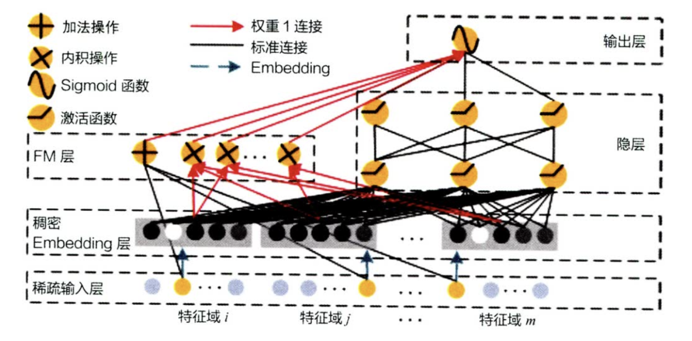

面试官您好，我想向您介绍一下我在（OTTO电商）推荐系统竞赛中的召回阶段项目。

# 1. 项目背景与核心挑战

**项目目标**： 这个项目的目标是为一个电商平台构建一个**多目标推荐系统**，来预测用户在一次会话（Session）中的点击、加购和下单行为。

**核心挑战**： 我拿到的数据是**高度匿名的**，只有三个字段：session（会话ID）、aid（物品ID）和 type（交互类型）。

**没有用户和物品信息**： 这意味着我无法构建长期的用户画像，也无法使用物品的品类、价格等内容信息。所有的推荐都必须基于匿名的“会话内”行为数据。

多目标： 点击、加购、下单三种行为的意图强度是完全不同的，但它们又高度相关。

我的整体架构：“**统一召回，分别排序**”。在召回中，我重点关注筛选物品的广度，构建多种召回通道。从千万商品中，快速“海选”出一个Top 500的候选池，确保这个池子

**数据集规模**：
aid数目：911164个（90万）

# 2. 召回策略
## 策略一：近期交互基线 (LastInter)
* **Motivation**:
  首先，我需要一个最快、最简单的基线来捕捉用户的“即时兴趣”。在电商中，用户刚刚交互过的东西是最重要的。
  
* **做法**：
  需要对物品交互的新旧程度进行衡量。因此对物品添加了这样的系数。`1.0 / (pl.max("ts") - pl.col("ts_right") + 1)`最后，我们返回了得分最高的前n个物品。（为什么是Max，不是sum？我们希望能够关心最新的一些物品。如果sum，很有可能在很久之前交互过多次的物品也被选中）

  因此，按 aid 分组，取 interaction_score 的最大值作为该物品的 final_score。然后对所有物品的得分降序排列，进行选择。

## 策略二：高级协同过滤 (Item-CF) i2i
* **Motivation**： 
* LastInter 只能“复读”用户看过的。我的第二个目标是“举一反三”，即“喜欢A的用户也喜欢B”。Item-CF 是实现这一目标最经典的策略。

* **问题与优化**：
  一个“朴素”的 Item-CF（只统计A、B的共现次数来衡量模型的相似性）效果会很差，因为它会被**热门**偏见、**时效性**和会话噪声严重干扰。

* **做法；引入多种惩罚系数**：（在计算每一个会话中的物品对 (A, B) 时，我都计算了四个系数的乘积）
  
  **热门惩罚**：（物品的出现次数）用 1 / log(count_A * count_B + C) 这样的公式，来压低那些超级热门物品对（如“牛奶”和“鸡蛋”）的权重。
  
  **时效性系数**：（物品的出现时间）提升“近期”才出现交互的物品对的权重，用于捕捉“潮流单品”。
  
  **时间差衰减**：（物品对的时间差）在一个会话中，如果A和B的交互时间间隔很近（如1分钟内），它们的关联性远高于间隔1小时的。我用 1 / 2^(时间差) 这样的指数衰减来建模。
  
  **会话质量惩罚**：（一个会话的交互物品个数）如果一个会话特别长（如交互了200次），我认为这个会话里的共现对是“低质量”的。我用 1 / log(会话长度) 来惩罚它们。

Item Swing
Item-Swing：**喜欢 A 和 B 的用户对 (u, v) 越多样化，物品越相似**而不仅仅是看共现的数量。$$sim(i, j) = \sum_{u \in U_i \cap U_j} \sum_{v \in U_i \cap U_j, v \neq u} \frac{1}{\alpha + |I_u \cap I_v|}$$

因此，将两个用户的**相同物品个数（交集）放在分母**，当交集越多（品味越雷同），则降低该两个用户此次共现的权重。

## 策略三：基于矩阵分解的物品召回 (Item-MF) i2i
* **Motivation**：
  Item-CF 捕捉的是**显式的共现关系。但我想更进一步，捕捉物品间潜在**的关联，即“A和B虽然没同时出现过，但它们都被C、D、E喜欢过，所以A和B也可能相似”。这就是矩阵分解（MF）的价值。

  并且这里只有用户的**隐式反馈**数据（是否交互），而没有**显式反馈**数据（评分），因此选择BPR损失。

* **训练样本**：

1. 训练数据是 “物品对”（aid_x, aid_y），代表 “用户先交互 aid_x，后交互 aid_y” 的共现关系
2. 对每个物品对（aid_x, aid_y）计算权重 --> **近期共现的非热门物品对权重更高**：包含**时间衰减系数**（时间差越大，系数越小（最长考虑7天），只对原物品计算），**流行度惩罚**（出现次数多则权重低，对两个物品都计算）

流行度惩罚：``1 / log1p(aid_size)`` 温和的惩罚，模型会更关注 “用户与冷门物品的匹配关系”

**模型结构**
* 1. Embedding: 将物品映射到低维空间，得到物品单位表示（嵌入纬度256）
* 2. 前向传播：计算物品对的嵌入表示的内积（代表相似度），同时乘以权重
* 3. 训练过程：**负采样**。训练目标是让 “真实共现的物品对（正样本）得分高于随机物品对（负样本）”，使用 **BPR** 损失优化，若正样本得分 > 负样本得分，损失小。
  ``loss = -torch.log(self.gamma + torch.sigmoid(pos_score - neg_score)).mean()``
  * 这里**按物品流行度加权负采样**,让采样概率**与物品的流行度（交互次数）成正相关**，但通过**指数0.75削弱极端热门物品的占比**（热门物品的权重增长变慢）。对每个物品的流行度取 0.75 次方作为采样权重（count^0.75），所有物品的权重之和为总权重（total_weight），比例就是采样概率。**完全随机采样（不考虑流行度）会导致大量低频物品被采样**
  * **负样本比例1:3**
* 4. 推理过程：有不同策略：用最后一个物品的嵌入向量，或者是最近物品的加权平均（时间权重线性衰减），作为查询向量。然后利用faiss库实现高效查找。

BPR损失 
BPR损失为解决**隐式反馈**数据下的推荐问题而提出的。它的基本思想是：给定一个用户和两个物品，模型需要将用户更喜欢的物品**排**在用户更不喜欢的物品之前，从而学习到用户的个性化偏好。（预测**相对排序**）

思路：让正样本和负样本之间的**得分之差尽可能的大**。通过sigmoid函数，将得分差映射到0-1之间。($\gamma$防止出现log(0))

$$\mathcal{L}_{BPR} = \sum_{(u, i, j) \in D_S} - \log\left(\gamma + \sigma\left(\hat{x}_{ui} - \hat{x}_{uj}\right)\right) $$

hinge loss
**Motivation**：
    BPR 和 RankNet 的**目标“太弱”了。它们只要求 score(i) > score(j)。如果 score(i) = 0.01 而 score(j) = 0.00**，BPR 就“满意”了，损失会很小。但这在嵌入空间中几乎没有拉开距离。
    Triplet Loss引入了一个“**安全边界** (Margin, $m$)”的概念，要求正样本得分必须至少比负样本得分大 m！”

$\mathcal{L}_{\text{Triplet}} = \max(0, m - (score(u, i) - score(u, j)))$

负采样
**采用流行度标准加权负采样**：count^0.75。
* 优点：避免全局随机负采样（很大可能抽到冷门物品）。同时通过0.75次方，降低极端热门物品的权重，提升冷门物品的权重。
* 其他采样方法：**困难负样本挖掘**：选择召回通过但排序未通过的困难负样本。
* 为什么不用困难负样本？必须首先拥有一个“还不错的”召回模型和排序模型，才能用它们去“挖掘”困难样本。

 faiss
faiss进行的是近似最近邻（Approximate Nearest Neighbor, ANN）搜索。通过**空间划分加速搜索**。

训练：聚类+建立索引。对所有的物品向量进行**k-means聚类**，每个簇的质心即为该簇的代表向量。然后建立一个索引，记录每个“区域”（簇）包含哪些物品向量（的ID）。

推理： 首先计算新样本与 k个“质心”的距离，得到最匹配的m个区域索引。然后只在此m个区域中进行搜索，找到topk个结果

FM和MF的异同点
**FM **(因子分解机)可以**自动学习特征之间的交互**。（如果数据中还有其他特征（例如：item_category），MF 完全无法利用它们。）预测不仅取决于单个特征，还取决于特征之间的组合。$$\hat{y}(x) = w_0 + \sum_{i=1}^n w_i x_i + \sum_{i=1}^n \sum_{j=i+1}^n \langle v_i, v_j \rangle x_i x_j$$ （包含一阶特征和所有**二阶交叉特征**）

**DeepFM**:
FM只能学习到二阶的交互，而DeepFM在学习二阶交互时效果不好。

模型包含DNN与FM两个部分，FM模型与DNN模型共享底层embedding向量，然后联合训练。

为什么没有用到u2i2i等？

## 召回策略四：基于矩阵分解的用户召回 (User-MF)
* **Motivation**：
* item-MF 学习的是“物-物”关系。我还想学习“人-物”关系，即捕捉这个**会话（Session）**的整体偏好。
(session_id, aid)

训练数据是 “用户 - 物品交互对”（session, aid），代表 “用户（会话）与物品发生过交互”，样本权重通过物品物品流行度修正。

Itemcf > user mf > Item mf 
## 召回策略五：基于上下文的物品召回 (Item2Vec)
* **Motivation**
在我之前提到的 Item-MF（矩阵分解）中，我学习的是“先A后B”的有序物品对（Ordered Pair）的关联。但用户的行为往往是“无序”的，比如他们在一个会话中购买了A、B、C，这**三者之间应该都存在关联**。为了捕捉这种更灵活的**“上下文”（Contextual）**关系，我引入了NLP领域中非常经典的 Word2Vec 模型，我称之为 Item2Vec。

* **优化与选择** (为什么用 Skip-gram？) 
  
  Word2Vec 有 CBOW 和 Skip-gram 两种算法，我在这里选择了 Skip-gram（即用中心词预测上下文）。
   **CBOW**(Continuous Bag-of-Word)：以上下文（在window大小内）词汇预测当前词。**SkipGram**：以当前词预测其上下文词汇

* Motivation： 这是因为在电商数据中，不可避免地存在大量长尾的低频物品（**冷门物品**）。

    CBOW（用上下文预测中心词）会将上下文的向量求和或平均，这会导致那些低频物品的信号被高频物品“淹没”掉。

    Skip-gram 则是让每个物品（包括低频物品）都有机会作为“中心词”去更新自己的向量。因此，它**对低频物品的 Embedding 训练得更充分**，这在召回任务中至关重要。
* **加速计算**：
  * 问题：需要对整个词汇表大小计算softmax,计算量太大
  * 改进方法：**Negative Sampling (负采样)**。模型不再预测每个词的概率，而是变成了一系列的二分类问题。详细来讲，对于训练样本将其视为正样本，然后从词汇表中随机抽取几个词作为负样本。模型的目标就变成了区分“哪个是正样本，哪些是负样本”。
  * $\mathcal{L}_{NEG} = \underbrace{-\log\left(\sigma(v_x \cdot v_y)\right)}_{\text{1. 拉近正样本：迫使模型预测 P(y=1)}} + \underbrace{\sum_{k=1}^{K} -\log\left(1 - \sigma(v_x \cdot v_{neg, k})\right)}_{\text{2. 推远 K 个负样本：迫使模型预测 P(y=0)}}$
  * $\sigma(\cdot)$ 是 Sigmoid 函数。
  * $\sigma(v_x \cdot v_y)$ 是模型预测“x 和 y 是真实共现对”的概率。
  * $\sigma(v_x \cdot v_{neg, k})$ 是模型预测“x 和 neg_k 是真实共现对”的概率。1 - \sigma(...) 就是模型预测“x 和 neg_k 是虚假共现对”的概率。

* **为什么效果不好？**
* 1. 一个会话（Session）可能长达数小时，包含上百次点击。当把多个毫无关联的物品视为一个“句子”时，上下文（Context）完全被污染了 -->只用 cart/order 物品来构建“高质量”的短句子。
* 2. Skip-gram 依赖一个核心超参数：window（上下文窗口大小），只关注紧邻的上下文。但是有可能在电商数据中相关物品相邻较远。 --> 尝试更大的窗口（如20）来捕捉长期依赖。
* 3. 几乎每个“句子”（会话）都包含热门商品，导致所有物品的 Embedding 都被拉向这些热门物品，使得所有物品的向量都变得很相似，丧失了区分度。 -> 热门物品降采样(genism中有相关参数)

# 特征工程
**Item侧**：
  1. 计算每个物品 (aid) 在最近不同时间窗口内，被交互的总次数，反应流行程度
  2. 每个物品 (aid) 在最近不同时间窗口内，根据其交互次数（点击、加购、购买等）所获得的全局排名
  3. 计算每个物品的交互时间的指标（平均、最大、最小等）（进行了归一化）
  4. 每个物品 (aid) 在同一个会话 (session) 中被“重复”交互（点击、加购、购买等）的概率
  5. 计算每个物品 (aid) 在最近不同时间窗口内，从一种交互类型“转化”到另一种交互类型的概率
**User侧**：
  1. 计算每个用户 (session) 的首次和最后一次交互事件分别发生在星期几
  2. 每个用户 (session) 在测试集 (test_df) 中发生的各种类型交互的总次数
  3. 计算每个用户 (session) 在其交互序列中，连续两次交互之间的时间差的统计特征
  4. 计算每个用户 (session) 进行交互平均发生在一天中的哪个小时
  5. 每个用户 (session) 的交互时间戳 (ts) 的各种统计指标
**交互侧**
  1. 对于每个用户 (session) 和物品 (aid) 的组合，该物品的首次、最后一次交互在该用户会话中的“顺序排名”是多少。
  2. 与该物品的交互是否是在session中的第一次/最后一次同类型交互
   
# 3. 排序策略

## 基于GBDT的模型

* **不同交互类型，不同参数**：
* 1. 树的数量和深度不同。target_click 的 n_estimators 是 600，而 target_cart 和 target_order 是 400。这是因为click 信号量大但嘈杂。模型需要更多的树（600 棵）来从这种高噪声数据中缓慢地、精细地学习复杂的模式，同时防止过早收敛。cart/order 信号量少但信噪比高。数据很稀疏，但信号很强。需要防止过拟合。
* 2. scale_pos_weight (正样本权重)不同。target_click 的 scale_pos_weight 是 100，而其他目标（cart/order 等）是 200。
* 3. order 事件更加稀有，需要一个更强的惩罚（scale_pos_weight=200）来迫使模型关注这些极其稀有的正样本

* **构建模型**
LightGBM, xgboost, catboost排序模型：预测在一个session内的排序。损失函数：lambdarank

lightgbm, xgboost, catboost构建分类模型：损失函数：交叉熵损失。

**NDCG (Normalized Discounted Cumulative Gain)**：排序质量评估指标。
  * 思想：高相关性的物品（target=1）应该排在前面。排在越前面，“功劳”越大。

1. G = Gain (增益)是什么？ 这是您列表（List）中每一个物品的“价值”或“相关性得分”。在您的代码中：由于您的任务是预测 click/cart/order，这是一个**二元（Binary）**相关性问题。如果一个物品是正样本（target=1），那么 Gain = 1。如果一个物品是负样本（target=0），那么 Gain = 0。
   
2. C = Cumulative Gain (CG, 累积增益)
3. 是什么？ 这是您列表 Top-K 中所有物品“增益”的总和。公式： $\text{CG}_k = \sum_{i=1}^k \text{Gain}_i$例子（k=3）：您的推荐列表 A：[A(Gain=1), B(Gain=0), C(Gain=0)]您的推荐列表 B：[B(Gain=0), C(Gain=0), A(Gain=1)]CG 的计算：CG@3(A) = 1 + 0 + 0 = 1CG@3(B) = 0 + 0 + 1 = 1致命缺陷：CG 不关心顺序！它认为列表 A 和列表 B 一样好，但这显然是错的。列表 A 远好于列表 B。CG 无法评估“排序”本身。

1. D = Discounted Cumulative Gain (DCG, 折扣累积增益)是什么？ DCG 解决了 CG 的“顺序”问题。它引入了一个“位置折扣（Position Discount）”：“排在越后面的物品，其 Gain（增益）越不值钱。”公式：

   $$\text{DCG}_k = \sum_{i=1}^k \frac{\text{Gain}_i}{\log_2(i + 1)}$$
   
2. N = Normalized (归一化)是什么？ DCG 解决了“顺序”问题，但它仍然有一个“公平性”问题。缺陷：session_1 可能有 10 个相关的 order 物品（正样本）。session_2 可能只有 1 个相关的 order 物品（正样本）。session_1 的“DCG满分”可能高达 8.0，而 session_2 的“DCG满分”最多只有 1.0。这导致我们无法跨 session（查询）来平均或比较 DCG 得分。解决方案： 我们需要将 DCG 得分“归一化”到 [0, 1] 区间。NDCG = (你的得分) / (满分)IDCG (Ideal DCG, 理想DCG)：“满分”就是 IDCG。 2.13最终公式：
3. $$\text{NDCG}_k = \frac{\text{DCG}_k}{\text{IDCG}_k}$$

常用评估指标
**召回**：
**Recall@K**（召回率@K）这是召回阶段最核心、最标准的指标。计算： 
$$Recall@K = \frac{\text{有多少“正样本”出现在了Top-K的召回列表中}}{\text{用户所有的“正样本”总数}}$$

**粗排**：
1. $$Recall@K' = \frac{\text{粗排后Top-K'列表中包含的正样本数}}{\text{用户所有的“正样本”总数}}$$

2. **AUC**（ROC 曲线下面积）是评估二元分类模型性能的“金标准”。代表模型将一个‘随机正样本’排在‘随机负样本’前面的概率。ROC曲线：Y 轴：真正类率 (TPR / Recall)，X 轴：假正类率 (FPR)

3. **GAUC**:高活跃用户主导，推荐系统的样本往往不均衡。GAUC 的原理：“先分组（按照user或者session），再平均”。GAUC 是所有单个 session 的 AUC **的加权平均值**。（权重通常是该 session 的曝光量（impressions）或点击量（clicks）

**精排**：
离线：GAUC， NDCG等

在线；
  点击率、转换率等。

## DIN模型

**输入特征**：
  * **用户画像**：用户id，用户侧统计数据
  * **交互序列**：物品id，物品侧统计数据
  * **候选物品**：物品id，物品侧统计数据

* 模型尝试：1. 首先只对于user id进行embedding，然后concat稠密向量。效果不好。-> 猜测是无法利用din擅长的非线性稠密特征的特点。因此对特征进行分桶。为每个桶学习一个embedding。（等频分桶，每个桶包含相同数量的样本）

**模型结构**
* 共享底层。通过embedding层提取交互序列的嵌入表示
* 对于候选物品，逐个计算其与last-n物品中的注意力权重（是一个小型的mlp，输入包含候选、目标物品特征，和交互特征（如相减）），然后加权求和。
* **多个不同输出头**，负责以二分类预测是否点击、购买等。

**多任务模型如何平衡**
* GradNorm：
* 在共享层中，希望让所有任务的**梯度‘力度’保持均衡**，并且让**‘难’的任务学得更快**。
* 首先，计算每个任务 i 的**梯度 L2 范数**（即“力度”）：
  $$G_i(t) = || \nabla_W (\lambda_i(t) \cdot \mathcal{L}_i(t)) ||_2$$
  注意： $\lambda_i(t)$ 此时是可学习的参数（nn.Parameter）。

* 然后，计算“平均梯度力度” G_avg我们计算所有任务的平均梯度力度，也是目标力度：
  $$G_{\text{avg}}(t) = \text{mean}_i (G_i(t))$$
* 之后，计算“学习速率比” ：
  $$\tilde{r}_i(t) = L_i(t) / L_i(0)$$ 的初始损失，到目前为止还‘剩下’百分之多少，代表学习的快慢。
  可以得到在不同任务中的归一化的“相对学习速率”：大于1代表学习得满
  $$r_i(t) = \tilde{r}_i(t) / \text{mean}_j(\tilde{r}_j(t))$$

* 现在，我们定义一个新的损失函数，这个损失函数只用来训练权重 $lambda_i$。
  $$\mathcal{L}_{\text{grad}}(t) = \sum_i |\text{G}_i(t) - (\text{G}_{\text{avg}}(t) \cdot r_i(t)^\alpha)|$$
  第一项是任务 i 当前的梯度力度，后面任务 i 应该有的目标力度。（如果学的慢，$r_i(t)^\alpha$会增大）

为什么效果mmoe < din < lgbm:

**特征原因**：
lbgm适合使用“统计型”稠密特征，DIN的核心优势在于自动学习“潜在表示”，但没有太多通过嵌入层的特征。

**数据量**：
训练集包含八百多万条数据，训练din数据量不够多，mmoe（多个专家 gate，参数更多）也不够。mmoe更难以训练

**信噪比原因**：
din处理的是匿名的、短期的 session 序列，但这个序列很可能充满了噪声