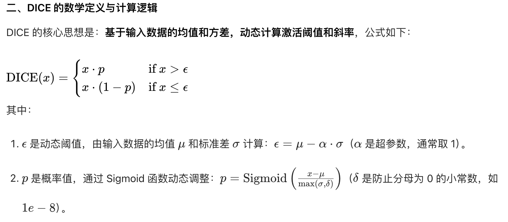
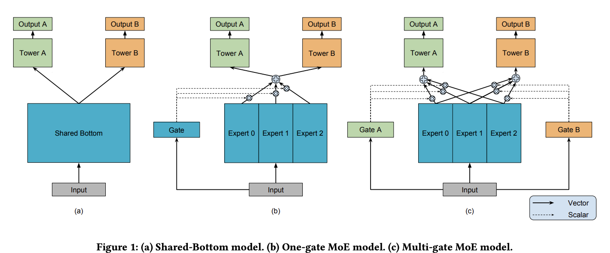
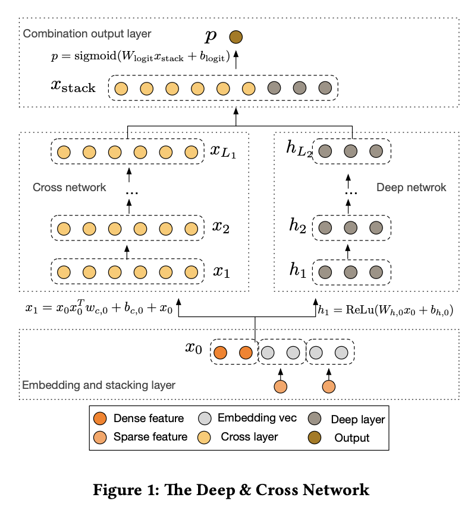
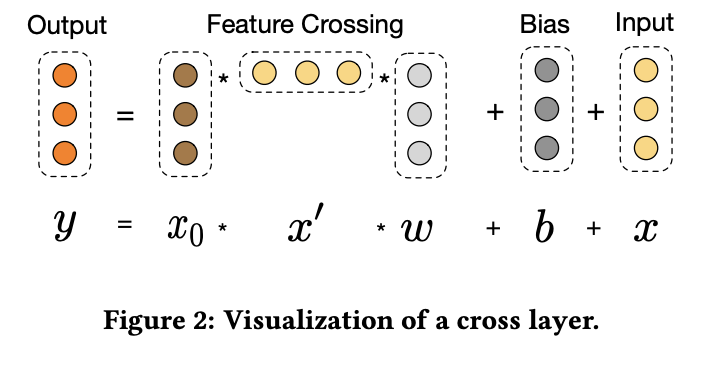

# 一、DIN

* DIN (Deep Interest Network)
* **Motivation**:
  * 很多深度学习推荐模型（例如基于 MLP 的简单模型）在处理用户历史行为时，通常会将用户过去交互过的所有物品的 Embedding 向量进行简单的池化 (Pooling) 操作，得到一个固定长度的用户兴趣向量。
  * 但是，**用户的兴趣往往是多样的**，并且用户的当前兴趣会受到目标物品（即正在考虑推荐给用户的候选物品）的影响。简单求和会稀释掉与候选物品真正相关的兴趣信号
  * DIN**引入注意力机制，自适应地关注用户历史行为序列中的相关部分**。

## 模型架构：
  
  1. **嵌入层 Embedding Layer**：将各种高维稀疏的 ID 类特征（用户 ID, 物品 ID, 物品类别, 历史交互物品 ID 序列等）映射为低维稠密的实数向量。
    
     ❗️输入特征：**用户画像特征**（user id, 性别年龄等），**物品特征**（item_id, category, 物品标题、图像等embedding），**上下文特征**（发生的时间、操作系统等），**用户行为序列特征**(最近交互过的物品 ID 列表，每个交互物品等类别等)。

     ❗️由于用户历史序列长度不一，通常需要固定一个最大长度 (max_seq_len)，对短序列进行填充 (Padding)，对长序列进行截断（通常保留最近的）。
  2. **激活单元/注意力机制**： 这里，查询向量$Q$是候选物品，$K, V$是得到的用户行为序列中每个物品的Embedding。对于用户last-n中的每个物品的embedding，计算候选物品与其相关性分数，然后以相关性分数为权重，将所有last-n的embedding向量加权求和，得到一个动态的、依赖候选物品的用户兴趣向量。

        记用户历史行为序列embedding为v$e_j, j = 1, ..., H$，候选物品嵌入表示为$v_A$，则最终User的兴趣向量为：
   
        $$V_U(A) = \sum_{j=1}^Ha(e_j, v_A)e_j$$
    
   
     ❗️这里的注意力/相关性得分与transformer不同，计算方法是计算Q与K的差值（或者内积、求和），然后与原始Q K进行拼接，输入到一个小型的MLP中（使用Dice）激活函数，最终输出一个数值.

     ❗️这里得到的注意力得分$a(e_j, v_A)$直接用于加权求和，**没有softmax归一化**，因为想保留用户兴趣强度，即原始的权重大小。

  3. **深度神经网络/多层感知机**：将上一步得到的加权用户兴趣向量、候选物品的 Embedding 向量、用户画像特征的 Embedding 向量、上下文特征的 Embedding 向量等**所有特征embedding全部进行concat拼接，输入到mlp**（激活函数入relu dice等），最终输出层只有一个神经元（只输出一个数值），并使用sigmoid激活函数（处理到0-1之间），**输出值即代表用户与该候选物品发生交互等概率**

## 模型训练
  
1.**损失函数** DIN 通常被用于预测用户对候选物品的交互概率，最常见的是点击率 (CTR) 预测，是二分类物品，因此可以使用交叉熵损失函数。
  
  ❗ **️关于交叉熵损失**：假设模型输出预测概率为$p$，真实标签为$y$，（为了数值稳定，引入$\epsilon$），则
  $Loss = -[y·\log{(p+\epsilon)}+(1-y)·\log(1-p+\epsilon)]$

  ❗ **️关于负采样**：由于原始数据通常只有正样本（用户交互过的记录），训练时需要构造负样本。负样本通常是从用户曝光过但未点击的物品中采样，或者从全局物品池中按流行度随机采样（排除掉用户交互过的物品）。
  
2.**激活函数** 
  
  

## 激活函数dice

* **1. PReLU 是什么？**

**PReLU** 的全称是 **Parametric Rectified Linear Unit** (参数化修正线性单元)。它是对经典激活函数 ReLU 和 Leaky ReLU 的一种改进。

* **回顾 ReLU**: $f(x) = \max(0, x)$。当输入 $x$ 小于 0 时，输出为 0，梯度也为 0，这可能导致“神经元死亡”问题。
* **回顾 Leaky ReLU**: $f(x) = \max(\alpha x, x)$，其中 $\alpha$ 是一个**固定的、很小**的正常数（例如 0.01）。它允许负输入有一个小的、非零的梯度，缓解了“神经元死亡”问题。
* **PReLU 的原理**: PReLU 的形式与 Leaky ReLU 完全相同：
    $$
    f(y_i) = \begin{cases} y_i & \text{if } y_i > 0 \\ \alpha_i y_i & \text{if } y_i \le 0 \end{cases}
    $$
    **核心区别**在于，PReLU 中的 $\alpha_i$ **不是一个固定的超参数**，而是一个**可学习的参数 (Learnable Parameter)**。
    * 这意味着，负区间的“斜率”$\alpha_i$ 会像网络的权重 `W` 和偏置 `b` 一样，通过**反向传播和梯度下降**进行学习和更新。
    * 模型可以**自适应地**为每个通道（`i`）学习一个最适合的负区间斜率。如果数据表明这个通道的负输入应该被完全抑制，模型可以将 $\alpha_i$ 学成 0（退化为 ReLU）；如果需要一个较大的负斜率，模型也可以学到。

  **PReLU 的优势**:

* 解决了 ReLU 的“神经元死亡”问题。
* 比 Leaky ReLU 更灵活，通过**从数据中学习**而不是手动设置，来找到最佳的负区间斜率，理论上能达到更好的性能。

---

* **2. Dice 激活函数**

**Dice** 的全称是 **Data Adaptive Activation Function** (数据自适应激活函数)，是 DIN 论文中提出的核心组件之一。

**Dice 的原理与动机**:

DIN 的作者观察到，深度神经网络中每一层输入的**数据分布是不断变化**的（这种现象被称为 Internal Covariate Shift）。一个固定的激活函数（无论是 ReLU 还是 PReLU，其修正点都在 0）可能不是最优的。Dice 的核心思想是让激活函数的**行为**能够根据**当前批次 (mini-batch) 数据的分布**进行**动态调整**。

它的工作方式如下：

1.  **批次内标准化**: 对于输入到 Dice 激活函数的某个批次的数据 `s`，首先计算该批次数据的**均值 `E[s]`** 和**方差 `Var[s]`**。然后对输入 `s` 进行类似 Batch Normalization 的标准化操作：
    $$
    s' = \frac{s - E[s]}{\sqrt{Var[s] + \epsilon}}
    $$
2.  **计算控制门 (Gate)**: 接着，用一个 Sigmoid 函数作用于标准化后的 $s'$，得到一个在 (0, 1) 之间的“门控”概率 $p(s)$：
    $$
    p(s) = \text{sigmoid}(s') = \frac{1}{1 + e^{-s'}}
    $$
3.  **自适应激活**: Dice 的最终输出是输入 `s` 的两个状态的加权平均，权重就是上面计算出的门控概率 $p(s)$：
    $$
    f(s) = p(s) \cdot s + (1 - p(s)) \cdot (\alpha s)
    $$
    其中 $\alpha$ 和 PReLU 中的一样，是一个可学习的负区间斜率参数。

**Dice 的优势与直观理解**:

* **自适应的修正点**: Dice 的“修正点”（即函数从近似线性区 `s` 过渡到近似修正区 `αs` 的位置）**不是固定的 0**，而是**动态地围绕当前批次数据的均值 `E[s]`**。
    * 当一个输入值 `s` 远大于当前批次的均值时，$s'$ 是一个大的正数，$p(s)$ 趋近于 1，此时 $f(s) \approx 1 \cdot s + 0 \cdot (\alpha s) = s$。激活函数表现为**恒等映射**（让信息通过）。
    * 当一个输入值 `s` 远小于当前批次的均值时，$s'$ 是一个大的负数，$p(s)$ 趋近于 0，此时 $f(s) \approx 0 \cdot s + 1 \cdot (\alpha s) = \alpha s$。激活函数表现为**修正**（乘以斜率 $\alpha$）。
* **平滑过渡 (Soft Rectification)**: 与 ReLU/PReLU 在 0 点的“硬”转折不同，Dice 的过渡是**平滑的**，因为它是由 Sigmoid 函数控制的。
* **结合了 Normalization 和 Activation**: Dice 将类似 Batch Normalization 的思想**内嵌**到了激活函数的设计中，使其对输入数据的分布变化更加鲁棒。

---

* **3. Dice 与 PReLU 的核心区别**

| 特性维度         | PReLU (参数化修正线性单元)                                     | Dice (数据自适应激活函数)                                                |
| :--------------- | :------------------------------------------------------------- | :----------------------------------------------------------------------- |
| **核心思想** | **参数化修正**: 修正点固定在 0，但负区间的斜率 $\alpha$ 是**可学习的**。 | **数据自适应修正**: 修正点**动态**地围绕**当前批次数据的均值**，斜率 $\alpha$ 也是可学习的。 |
| **自适应机制** | 通过**反向传播**，在**整个训练过程**中学习一个（或每通道一个）**全局**的 $\alpha$ 参数。 | 通过**批次统计量 (均值/方差)**，在**每次前向传播**时**局部地**、**动态地**调整激活行为。 |
| **修正点** | **固定**在 0。                                                  | **不固定**，围绕当前批次的均值 `E[s]`。                                  |
| **过渡方式** | **硬过渡** (Hard Rectification)，在 0 点有一个明显的“拐点”。      | **软过渡** (Soft Rectification)，由 Sigmoid 函数控制，过渡区域是平滑的。        |
| **对数据分布的依赖** | 激活行为**与输入数据分布无关**（只取决于输入值是正还是负）。     | 激活行为**高度依赖于当前批次的数据分布**（均值和方差）。                   |

**一句话总结区别**:

**PReLU 是让模型学习一个“全局最优”的负斜率，但修正点始终在 0；而 Dice 则是让激活函数的修正点“随波逐流”，始终保持在当前数据分布的中心位置，从而实现更强的自适应性。**

# 二、DNN
基础 **DNN (Deep Neural Network) **模型。通常指的是推荐系统领域最经典的“**Embedding + MLP**”架构

将所有高维稀疏的类别特征（如 user_id, aid）通过嵌入 (Embedding) 转换为低维稠密的向量，然后将这些向量与所有数值型特征拼接 (Concatenate) 在一起（即离散特征需先通过嵌入层转为向量，稠密向量可以直接拼接）。，最后喂给一个多层感知机 (MLP)，并输出最终的预测概率（例如点击率）。

# 三、MMOE
**MMOE (Multi-gate Mixture-of-Experts)**，是一种多任务学习 (Multi-Task Learning, MTL) 架构，是专为多目标推荐设计的 DNN 模型，核心是在共享特征提取能力的同时，为不同目标保留特异性，解决多目标间的冲突与信息共享问题。

## 问题背景
* 在推荐系统中，我们往往不只关心一个指标，例如我们希望同时优化点击率(Click-Through Rate, CTR)和购买率(Conversion Rate, CVR)。这就是一个典型的**多任务学习 (MTL)** 场景。我们希望训练一个模型，它能**同时预测** CTR、CVR。
* **传统方法：Shared-Bottom**：共享底层架构。模型底部是一个共享的神经网络（例如 Embedding 层 + 几层 MLP），它负责学习所有任务通用的基础特征表示。然后，在这个共享底层之上，分叉出多个“塔” (Tower)，每个“塔”是一个任务专属的小型网络，负责预测自己的目标（如 CTR Tower, CVR Tower）。
* **传统方法的缺陷**：缺陷：“负迁移” (Negative Transfer)（一个任务的优化过程对另一个任务产生了负面影响。）。现实中，不同任务之间的关系是复杂的，不同任务可能关注模型的不同特征。优化一个任务（如 CTR）可能会损害另一个任务（如 CVR）的性能。Shared-Bottom 模型无法处理这种任务间的冲突，导致整体性能受限。
* **借鉴MOE**：与其只学一个共享底层，不如学习多个**专家**(Experts)，每个专家都是一个小型神经网络 (MLP)。然后，再训练一个**门控网络(Gating Network)**，这个门控网络会根据输入特征，决定该“听取”**每个专家的意见（权重）各占多少**，最后将所有**专家的输出加权求和**。

## 模型结构
**核心思想**
保留了**共享的多个专家** (Shared Experts)，但是为每一个任务**都配备了一个专属的门控网络**(Task-Specific Gate)输出每个专家的权重

1. **输入与嵌入(Embedding)**:接收高维稀疏特征（如用户 ID, 物品 ID, 特征工程得到的各种特征），通过 Embedding 层转换为低维稠密向量，然后拼接 (Concatenate) 成一个单一的输入向量 $x$
2. **共享专家层(Shared Experts Layer)**：包含 $N$ 个独立的专家网络 $E_1, E_2, ..., E_N$，每个专家 $E_i$ 通常是一个简单的前馈神经网络 (MLP)，分别输出一个结果向量$E_i(x)$。不同专家负责学习不同维度的特征模式。
3. **多门控网络层 (Multi-Gating Network Layer)**：假设有 $K$ 个任务，就有 $K$ 个独立的门控网络 $G_1, G_2, ..., G_K$。每个门控网络 $G_k$ 本身也是一个小型神经网络（通常是一个线性层或简单的 MLP），它的输入同样是 $x$。每个门控的输出是一个 $N$ 维的向量，这个向量会经过 Softmax 激活函数，得到 $N$ 个权重值，且权重之和为 1，**代表了该任务下不同专家的权重**
4. **任务塔层 (Task Towers Layer)**： 对于每个任务 $k$，它会使用它自己的门控网络 $G_k$ 输出的权重 $g_k(x)$，去对所有共享专家的输出 $E_i(x)$ 进行加权求和，然后输出目标任务的预测结果。
   
   任务 $k$ 的塔 (Tower) 的输入 $f_k(x)$ 被定义为：
   $$f_k(x) = \sum_{i=1}^{N} g_{k}(x)_i \cdot E_i(x)$$

   最后，这个 $f_k(x)$ 被送入任务 $k$ 专属的上层网络（Tower $k$，通常又是几层 MLP），计算出该任务的最终预测值

## 训练
1. **前向传播**: 如上所述，一个输入 $x$ 会同时经过**所有专家和所有门控**，最终输出 $K$ 个任务各自的预测值（$\hat{y}_{\text{click}}, \hat{y}_{\text{cart}}, \hat{y}_{\text{order}}$）。
2. **损失函数**: 总损失 $L_{\text{total}}$ 是**所有单个任务损失的（加权）总和**。例如，对于 click/cart/order 这种 0/1 目标，就是**二分类交叉熵损失** (Binary Cross-Entropy / LogLoss)

# 四、DCN

## 问题背景
* 推荐系统中的排序模型主要面临一个**特征交互 (Feature Interaction)**的难题，因子分解机 (Factorization Machines, **FM**) 能够自动学习二阶特征交互（user_id 和 item_id 的交互），但难以高效地学习更高阶的交互。

## 模型架构：
* **主要思想**：采用了并联结构（类似于 Wide & Deep 模型），由两个核心部分组成：一个深度网络 (Deep Network) 和一个交叉网络 (Cross Network)，两者共享相同的输入，最后将它们的输出拼接起来进行预测。

* 1. **输入嵌入层 embedding**:类别特征 (如aid, category): 经过 nn.Embedding 层，转换为低维、稠密的嵌入向量。数值特征 ( 如 price, item_inter_num): 经过（可选的）归一化处理。拼接: 将所有的嵌入向量和数值特征全部拼接 (Concatenate) 在一起，形成一个单一的、扁平的输入向量 $x_0$。
* 2. **深度网络 Deep Network**：标准的多层感知机 (MLP)，通过多层非线性变换，隐式地捕捉特征之间高度复杂、高阶的交互关系。
* 3. **交叉网络 Cross Network**：由多层“交叉层” (Cross Layer) 堆叠而成。显式地、自动地学习特征交互，每一层都会在上一层的基础上增加一阶交互
  
  核心公式 (第 $l$ 层):从第 $l$ 层的输出 $x_l$（一个向量）计算第 $l+1$ 层的输出 $x_{l+1}$（也是一个向量）：
  $$  x_{l+1} = \underbrace{x_0 x_l^T w_l}_{\text{特征交叉项}} + \underbrace{b_l}_{\text{bias}} + \underbrace{x_l}_{\text{残差连接}}$$

  其中$x_0$是原始输入，$x_l$是本层输入，$x_l^T w_l+b_l$是本层输入经过mlp得到的输出。

  ❗**️核心交叉操作**：$x_0 (x_l^T w_l)$。用最开始的原始输入 $x_0$（向量）去乘以那个标量。这实现了 $x_0$ 中的所有特征与 $x_l$（包含了 $l$ 阶及以下交互信息）的显式交叉。

  ‼**️残差连接**：$+ x_l$。它将当前层的输入 $x_l$ 直接加到输出上。这使得 $x_{l+1}$ 不仅包含了新学到的 $(l+1)$ 阶交互，还继承了 $x_l$ 中包含的所有低阶交互。

  💯 这里，每一个交叉层的参数$x_0$ 是**维度为$d$的向量！**，在参数上极其高效。$x_l^T w_l$: 两个 $d$ 维向量的点积 (Dot Product)，结果是一个标量。

* 4. **组合层 combination**将 Cross Network 的最终输出 $x_L$ 和 Deep Network 的最终输出 $v_{\text{deep}}$ **拼接**在一起。 将这个拼接后的向量喂给一个标准的mlp层（即一个带 Sigmoid 的全连接层），输出最终的预测概率 $p$。