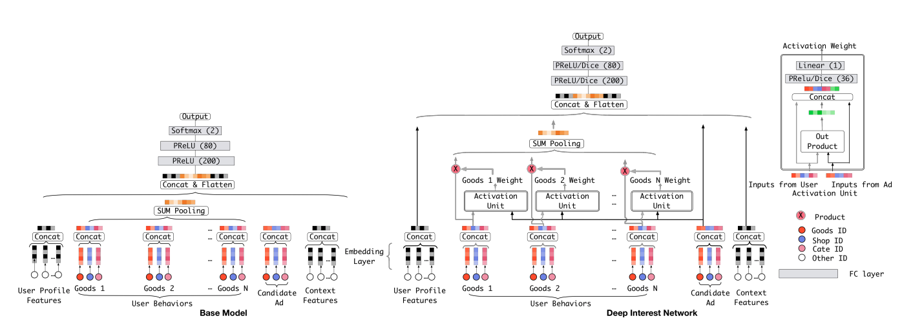
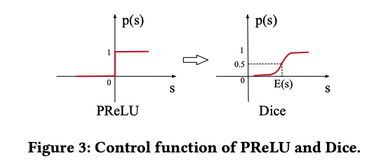

# DIN

* DIN (Deep Interest Network)
* **Motivation**:
  * 很多深度学习推荐模型（例如基于 MLP 的简单模型）在处理用户历史行为时，通常会将用户过去交互过的所有物品的 Embedding 向量进行简单的池化 (Pooling) 操作，得到一个固定长度的用户兴趣向量。
  * 但是，**用户的兴趣往往是多样的**，并且用户的当前兴趣会受到目标物品（即正在考虑推荐给用户的候选物品）的影响。简单求和会稀释掉与候选物品真正相关的兴趣信号
  * DIN**引入注意力机制，自适应地关注用户历史行为序列中的相关部分**。

* **模型架构**：
  
  1. **嵌入层 Embedding Layer**：将各种高维稀疏的 ID 类特征（用户 ID, 物品 ID, 物品类别, 历史交互物品 ID 序列等）映射为低维稠密的实数向量。
    
     ❗️输入特征：**用户画像特征**（user id, 性别年龄等），**物品特征**（item_id, category, 物品标题、图像等embedding），**上下文特征**（发生的时间、操作系统等），**用户行为序列特征**(最近交互过的物品 ID 列表，每个交互物品等类别等)。

     ❗️由于用户历史序列长度不一，通常需要固定一个最大长度 (max_seq_len)，对短序列进行填充 (Padding)，对长序列进行截断（通常保留最近的）。
  2. **激活单元/注意力机制**： 这里，查询向量$Q$是候选物品，$K, V$是得到的用户行为序列中每个物品的Embedding。对于用户last-n中的每个物品的embedding，计算候选物品与其相关性分数，然后以相关性分数为权重，将所有last-n的embedding向量加权求和，得到一个动态的、依赖候选物品的用户兴趣向量。

        记用户历史行为序列embedding为v$e_j, j = 1, ..., H$，候选物品嵌入表示为$v_A$，则最终User的兴趣向量为：
   
        $$V_U(A) = \sum_{j=1}^Ha(e_j, v_A)e_j$$
    
   
     ❗️这里的注意力/相关性得分与transformer不同，计算方法是计算Q与K的差值（或者内积、求和），然后与原始Q K进行拼接，输入到一个小型的MLP中（使用Dice）激活函数，最终输出一个数值.

     ❗️这里得到的注意力得分$a(e_j, v_A)$直接用于加权求和，**没有softmax归一化**，因为想保留用户兴趣强度，即原始的权重大小。

  3. **深度神经网络/多层感知机**：将上一步得到的加权用户兴趣向量、候选物品的 Embedding 向量、用户画像特征的 Embedding 向量、上下文特征的 Embedding 向量等**所有特征embedding全部进行concat拼接，输入到mlp**（激活函数入relu dice等），最终输出层只有一个神经元（只输出一个数值），并使用sigmoid激活函数（处理到0-1之间），**输出值即代表用户与该候选物品发生交互等概率**

* **模型训练**
  
  1.**损失函数** DIN 通常被用于预测用户对候选物品的交互概率，最常见的是点击率 (CTR) 预测，是二分类物品，因此可以使用交叉熵损失函数。
    
    ❗ **️关于交叉熵损失**：假设模型输出预测概率为$p$，真实标签为$y$，(为了数值稳定，引入$\epsilon$），则
    $$Loss = -[y·\log{(p+\epsilon)}+(1-y)·\log(1-p+\epsilon)]$$

    ❗ **️关于负采样**：由于原始数据通常只有正样本（用户交互过的记录），训练时需要构造负样本。负样本通常是从用户曝光过但未点击的物品中采样，或者从全局物品池中按流行度随机采样（排除掉用户交互过的物品）。
    
    2.**激活函数** 
    