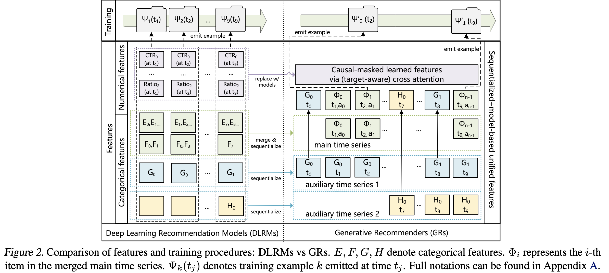

# 背景介绍
**传统方法**：Deep Learning Recommendation Models (DLRMs)
**HSTU**:将传统的排序和检索任务，视为生成建模。

🤯**DLRM的不足**：
1. **特征缺少明确结构**：使用大量异构特征，包含连续稠密的数值特征，和离散的类别特征。
2. **词汇表规模极高**：候选物品词汇表规模高，训练、测试计算慢
3. **大模型训练计算开销大**，相较于大语言模型，推荐系统数据量更大。

😍**HSTU的主要改进**：
1. 对DLRM的输入进行统一化、序列化。（将所有输入特征编码为**统一的时间序列**）
2. 提出了HSTU，取代传统的transformer注意力计算，提升计算速度
3. 提出新算法 M-FALCON，通过微批处理完全摊销计算成本，降低计算成本。

# 模型内容
## 特征处理

**类别特征**：（变换慢）
我们首先选择最**长的时间序列**（通常是通过合并代表用户的last-n序列）作为**主时间序列**。其余特征通常是随时间**缓慢变化的类别型时间序列**。我们压缩这些时间序列，保留每个连续段落的**最早条目**，然后将结果合并到主时间序列中。

**稠密特征**：（变换快）
例如点击率等，可能随着每次用户行为都在改变--> 从计算、存储角度，**不能完全序列化**。因此，只要计算准确度够高，类别数据够丰富，就可以**移除稠密特征**！