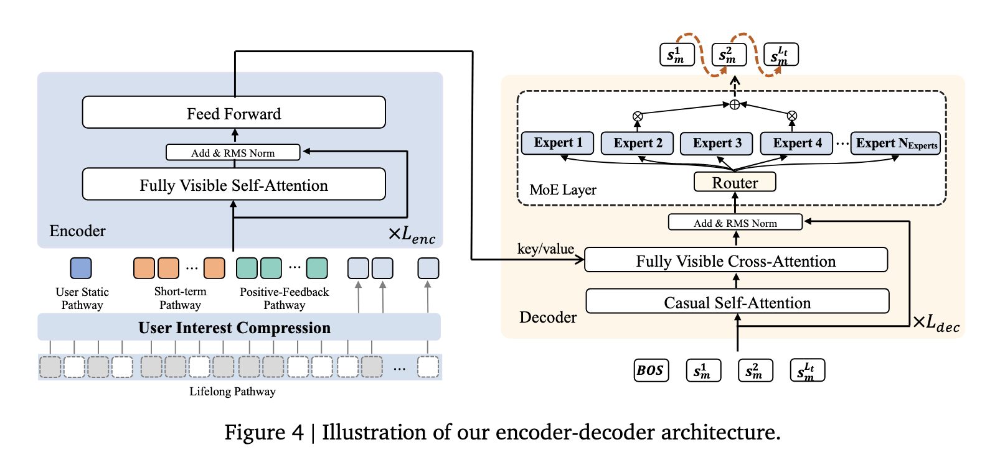
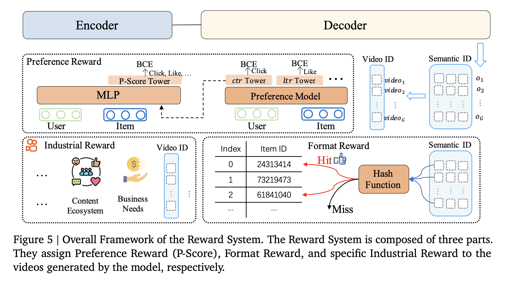

# 背景

* 传统DLRM采用**级联**策略，召回-粗排-精排。每个独立的排序器的效果决定了最终的结果上限，即使进行排序器间的交互。
* GR:基于**生成式的召回**方法。但这类方法只能用于召回，准确性无法与多级联的模型相比。

!!! note 本文贡献
    1. **Encoder-Decoder架构**：基于MoE模型，提升模型的参数量
    2. **提出基于会话列表生成session-wise的方法**：不同于point-by-point generation（难以平衡连贯性和多样性,需要制定策略保证多样性和连贯性），session-wise自动学习会话内整体物品的内容和顺序,更好地捕捉用户在会话中的兴趣动态。
    3. **使用DPO进行偏好学习**。传统的偏好学习通常依赖于人类明确标注的偏好数据。但推荐系统中交互数据稀疏，难以获取。不随机抽取负样本，而是从束搜索结果中创建self-head rejected samples。（关于抽样，提出了迭代偏好对齐策略，用预训练的奖励模型提出的得分对采样结果进行排序，确定最优/差rejected samples）

* 关于大模型的偏好对齐：
  * 1. RLHF：LLM通常使用RLHF，通过强化学习，将LLM结果与人类价值观进行对齐。但RLHF效率低（先训练奖励模型RM，然后用RM指导大模型）
  * 2. DPO：**跳过了训练奖励模型和强化学习**这两个步骤，而是设计了一个巧妙的损失函数，**直接在偏好数据上对LLM进行微调**。
   
# Tokennizer
通过使用精简和固定的词汇表，将物品token为coarse-to-fine的语义ID。将协作信号与多模态特征整合在一起，然后利用 RQ-Kmeans（Luo 等人，2024 年）生成更高质量的分层语义 ID。

* **对齐的协作感知多模态表示**
  * 1. 多模态表示：将标题、标签、视频等多个那栋，使用模型进行处理，然后使用基于TRansformer的模型，对每个样本生成**4个向量**（coarse-to-fine的语义ID），作为该物品的表示。
  * 2. 相似物品对：使用U2I或者I2I召回，基于高相似度，得到物品对。
  * 3. 训练目标：item to item的对比损失与下一个目标预测损失，

* **Tokenization**
  * 1. 使用RQ-Kmeans进行分词。采用残差两话技术，从粗到细生成语义ID。直接对残差进行K-means聚类构建编码本。设定了多级的codebook，每一级codebook对前一级的表征残差进行聚类，第一级就是多模态表征本身。聚类算法采用Balanced K-means，保证每个类簇包含的item数量相同。
  
## Encoder
### 多尺度的特征工程
包含多个模式：用户静态途径、短期途径、正反馈途径和终身途径。
* **User static Pathway**:
    包含用户核心特征，例如id， age等，然后转化为隐层维度
* **Short-term Pathway**：
    包含用户最近交互过的L（如20）个物品：物品标识符（可以像tokenizer一节中这样表示），作者标识符，标签等。同样
* **Positive-feedback Pathway**：
    一串高参与互动的基础上进行的（如256个物品）
* **Lifelong Pathway**：
    处理超长的用户行为序列。采用了两个阶段对这一超长序列分层压缩。使用聚类的思路，对超长序列进行层次聚类做聚合处理：先用聚类中心的表征做代表，然后再经过QFormer

### Encoder结构
* 输入：$n$长的用户历史行为序列（例如视频id）
* Encoder-Decoder模型采用了**MoE进行高效的参数量扩展**。模型进行了2个阶段的训练，第一阶段采用基础的item预测任务，第二阶段采用DPO进行偏好对齐。

* 编码器的结构就是常见的Transformer

## Decoder结构
* 输入：Encoder输出的用户表示，来自回归地逐个（point wise）生成目标推荐视频的语义ID。（输入序列的开头有一个特殊的起始符）
* 结构：
  * 1. 因果自注意力（相当于掩码自注意力，加入上三角矩阵，-inf）
  * 2. 交叉注意力（上一部的输出是Q, Encoder的输出是K和V）
  * 3. **MOE取代FFN**: 设计了多个Expert，同时会有一个门控决定哪些专家被激活。1. **显著增加参数，提高模型学习表示能力**：之前一个FFN，现在多个模型，大幅提升模型表达能力。2. **不显著增加推理计算量**：由于激活的稀疏性，每次只激活少数个专家，因此每次前向传播只激活一小部分参数。

loss-free load balancing strategy following专家负载均衡策略
* 传统方法：在损失中加入正则化项，但是会干扰主梯度
* 专家负载均衡策略：首先在每轮训练后，计算专家负载（处理的token数），然后计算**偏差**（与平均值的水平）。负载高的专家将降低偏差b。之后，在进行 Top-K 路由决策之前，将这个**动态调整的偏差** $b_i$ 直接加到路由器为专家 $i$ 计算的原始路由得分上。然后**用加入偏差的得分来选择topk专家。**
* 用交叉熵损失进行下一个词的预测

## 奖励系统 Reward System
预训练模型仅通过下一个token预测来拟合已曝光物品空间的分布，而这些曝光物品是来自过去传统的推荐系统。这导致模型无法突破传统推荐的上限。

为了解决这一问题，我们引入了**基于奖励系统的偏好对齐方法**，使用基于策略的强化学习在生成的物品空间中训练模型。通过奖励机制，模型能够感知更细粒度的用户偏好信息。

我们引入了三种奖励：偏好奖励用于对齐用户兴趣，格式奖励用于确保生成结果的格式尽可能合法，特定行业奖励用于满足某些特殊行业场景的需求。

### 用户偏好对齐
* 传统方法：对于多个目标的预测值进行加权融合 -> 缺乏个性化，可能导致优化冲突
* 解决方法：使用神经网络学习个性化的融合评分，称为p-score（偏好得分）。

* 底层架构是SIM，然后有多个塔，分别计算不同的指标，用BCE做LOSS。最后用一个MLP综合得到最终的偏好得分。
* 这个P-Score被用作RL中的核心奖励信号。
优化算法（ECPO） 

### ECPO（Early Clipped Group Relative Policy Optimization）
* 为了使用P-Score奖励来稳定地优化生成模型，OneRec提出了一种名为ECPO（Early Clipped Group Relative Policy Optimization）的算法。
* 它是**对GRPO的改进**，核心思想是通过**提前裁剪那些具有负优势**（negative advantage）且策略比率过大的**样本，来防止梯度爆炸**，从而增强训练的稳定性。
* 原始的GRPO中，允许负优势具有较大的策略比率，这可能导致梯度爆炸。因此，我们会先发制人地裁剪具有大比率的策略，以确保训练稳定性，同时仍允许相应的负面优势生效。Δ 越大，可容忍的政策比率越大，这意味着可容忍的梯度越大。这可以根据实际需要确定。
