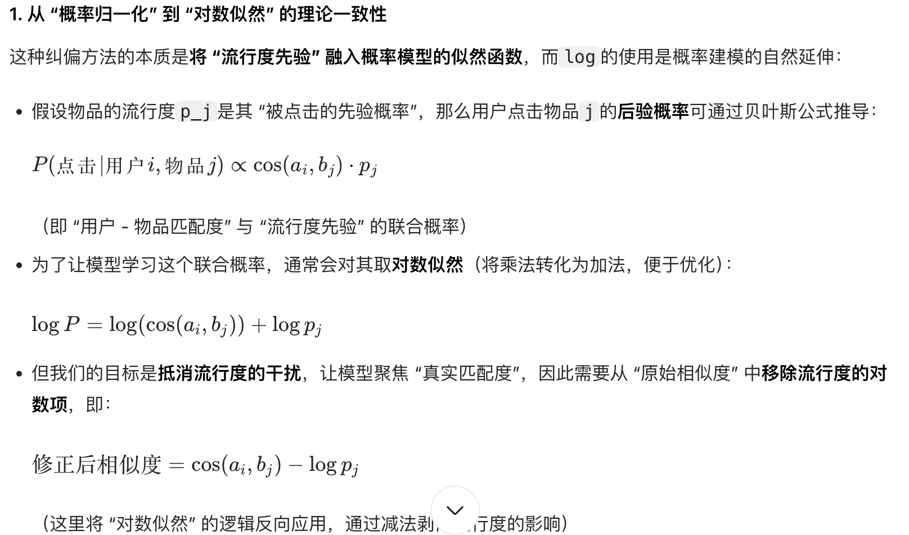
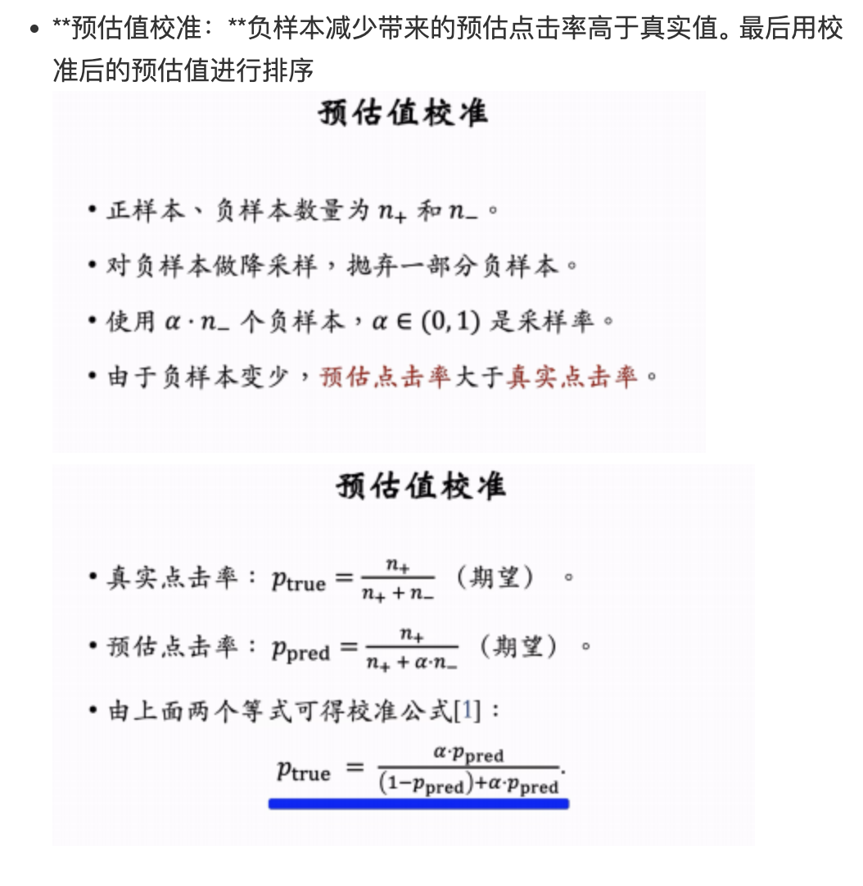
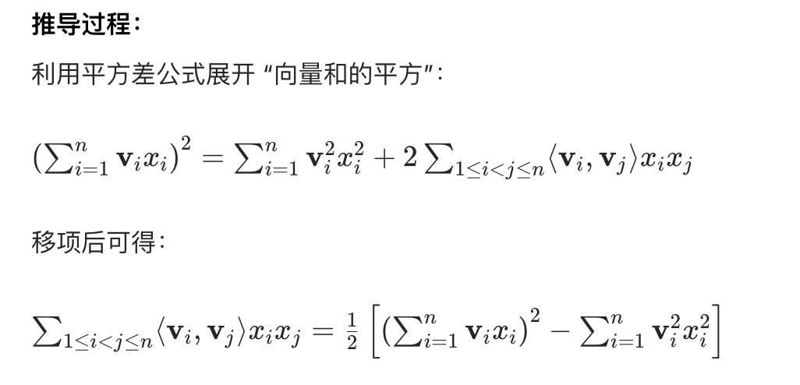

1. **召回、排序的样本区别**
   1. 召回（Recall）样本： 目标是“大海捞针”。其样本是“隐式反馈”，正样本是 (用户, 目标物品)，负样本是从数以亿计的、用户“没见过”的物品中“采样”出来的。
   2. 精排（Ranking）样本： 目标是“精准排序”。其样本是“显式反馈”，正负样本都来自用户“真实看到过”的曝光日志（impression=1），正样本是点击（click=1），负样本是未点击（click=0）。

2. **为什么选择困难负样本作为召回的负样本**
   1. 困难负样本：通过了召回，没有通过排序。

3. **给你一个新物品的emb，如何做这个物品的冷启动**
   1. 您的模型在训练老物品时，已经把品类、品牌等内容特征作为Embedding层进行了训练。分别查出不同品类的embedding，做汇聚
   2. 生成法：简历物品他，输入内容特征，自动学习

4. **双塔模型的主要问题**
   1. “用户塔（User Tower）和物品塔（Item Tower）在训练时彻底解耦，互不交叉。在用户、物品塔中为每个id学习一个嵌入表示，导致信息损失，且“平均化”向量，无法代表用户在特定场景下的具体兴趣。
   2. 解决方法：不再强迫用户塔输出一个“平均”向量，而是让它输出K个代表用户不同兴趣“侧面”的向量。
   3. 双塔模型通常使用“In-Batch 负采样”训练，大部分负样本都太“简单”了，热门物品（如iPhone）会更频繁地作为正样本出现，因此也更频繁地成为其他所有人的负样本。
   4. 解决方法：全库采样，困难负样本采样

5. **兴趣预估-纠偏**
   1. 来源：为了让模型学得更快，我们通常倾向于采样热门物品作为负样本。然而，如果你按照流行度 $Q(j)$ 进行采样，模型会倾向于过度压低热门物品的得分，因为它在负样本中出现得太频繁了。
   2. 修正：假设物品的流行度是流行度p_j，减去该物品被采样的对数概率。\(\text{修正后相似度} = \text{cos}(a_i, b_j) - \log p_j\)
   

6. **点击率-纠偏**
   

7. **FM如何降低计算量？**
   1. 参数分解： 用向量点积 $\langle \mathbf{v}_i, \mathbf{v}_j \rangle$ 代替独立的 $w_{ij}$，解决了参数存储量过大的问题。
   2. 数学变换： 利用“和的平方减去平方的和”公式，解耦了 $i$ 和 $j$ 的依赖，将复杂度从 $O(n^2)$ 降为 $O(kn)$。
   
   3. 稀疏性：只针对非零值进行计算

8. **XGBoost如何处理缺失值？**
   XGBoost 采用 **“自动学习缺失值的分裂方向”** 的策略，在树的分裂过程中，若样本的某特征值为缺失，算法会尝试将该样本同时**分配到左子树和右子树**，分别计算两种分配方式下的 “分裂增益”。最终选择 “增益最大” 的那个子树作为缺失值样本的分裂路径，并记录该规则。后续所有缺失值样本都会按照此规则被分配到对应的子树中。

9. **Item2Vec用户点击了全新的物品怎么办？**
    当用户点击了一个物品 $X$：
   1. 判断 $X$ 是否在 Item2Vec 词表中？
      1. 在 (In-Vocabulary):直接读取 Redis 中的 I2I 相似列表。或者拿 $X$ 的向量去 Faiss 中实时搜 Top-N。
      2. 不在 (Out-of-Vocabulary):降级策略 (Fallback): 触发基于同类目、同品牌的规则召回。
      3. 近似策略: 利用 $X$ 的属性（Category/Tag）的平均向量，去召回相似的老物品。
   2. 更新用户画像:将 $X$（或 $X$ 的属性向量）加入用户的短期兴趣序列，实时更新用户的 Embedding，用于下一次请求的打分。