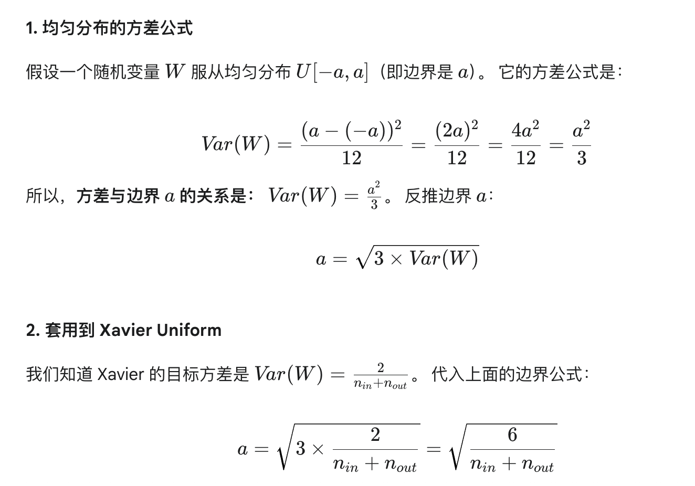

1. **神经网络初始化方法如何选择？**
    选择策略主要取决于你使用的激活函数（Activation Function）。
    1. 核心原则：方差保持 (Variance Preservation)假设一个神经元的输出是 $y = w_1x_1 + \dots + w_n x_n + b$。
        
        为了让网络能学得动（数值保持稳定），我们需要保证：
        前向传播时：输入信号的方差 $\approx$ 输出信号的方差。
        反向传播时：输入梯度的方差 $\approx$ 输出梯度的方差。

    2.  激活函数是 Sigmoid 或 Tanh（对称） $\to$ Xavier (Glorot) 初始化：
        1.  Sigmoid 和 Tanh 函数在输入值很大或很小时，导数趋近于 0（梯度消失）。因此，权重必须比较小，让输入落在激活函数的“线性区”（中间部分）。
        2.  理论方差：$Var(W) = \frac{2}{n_{in} + n_{out}}$取两者的调和平均。
        3.  具体分布选择：Xavier Normal (正态分布):$$W \sim N\left(0, \sqrt{\frac{2}{n_{in} + n_{out}}}\right)$$Xavier Uniform (均匀分布):$$W \sim U\left[-\sqrt{\frac{6}{n_{in} + n_{out}}}, \sqrt{\frac{6}{n_{in} + n_{out}}}\right]$$
        
    3.  激活函数是 ReLU (及其变体 Leaky ReLU) $\to$ He (Kaiming) 初始化
        1.  ReLU 把负半轴的输入变成了 0，这意味着它“扔掉”了一半的信号能量。为了弥补这一半的损失，He 初始化通过把方差乘以 2 来保持信号强度。
        2.  理论方差：$Var(W) = \frac{2}{n_{in}}$ (注意：只考虑输入维度)具体分布选择：He Normal (正态分布):$$W \sim N\left(0, \sqrt{\frac{2}{n_{in}}}\right)$$He Uniform (均匀分布):$$W \sim U\left[-\sqrt{\frac{6}{n_{in}}}, \sqrt{\frac{6}{n_{in}}}\right]$$
2.  **为什么不能全0初始化**
   全 0 初始化会导致 “神经元功能完全一致”。对于不同神经元的输出会完全相等，反向传播也是一样的梯度。