[课程链接](https://space.bilibili.com/1369507485/lists/615109?type=season)

# 概述

## 3. 推荐系统的AB测试

1. **分层实验** ：同层互斥（同类的策略），不同层（不同类型的策略）正交 --> 可以做多组实验
2. **Houldout机制**：Holdout桶不会安排任何实验，作为对照组，可与实验组计算指标差值衡量效果
   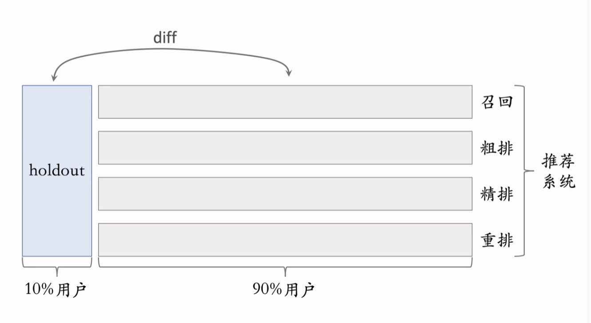
3. **实验推全**：新策略在小流量实验中有效 -> 推广到整体实验组
4. **反转实验**：实验指标有可能具有滞后性，需要长期观测。但实际应用中若有效需尽快推全，以供新实验使用。存在矛盾！->用反转实验解决矛盾：在推全的新策略中单独一块放置旧策略，实现长期观测新策略和旧策略的diff!
   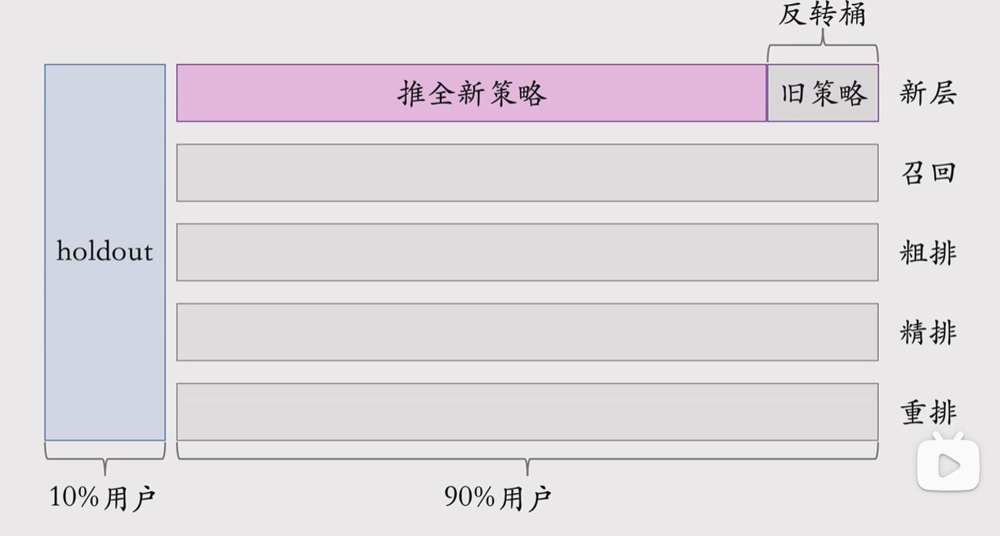
   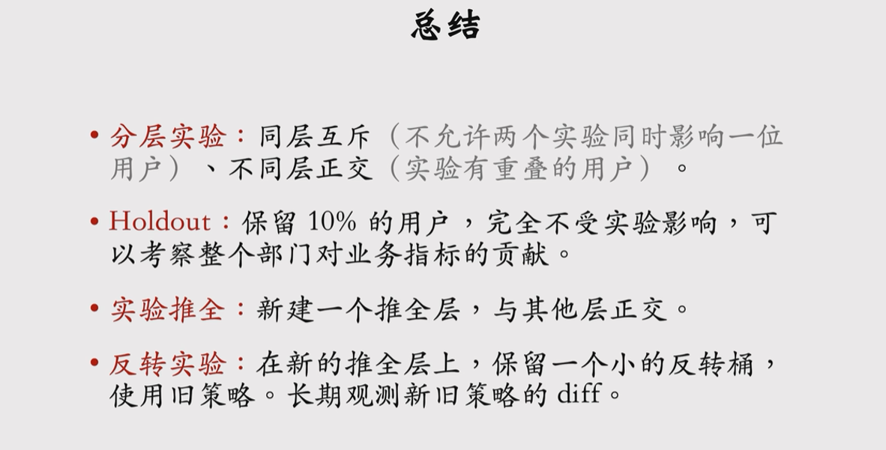

## 召回
### 1. 基于物品的协同过滤 (ItemCF)

* **ItemCF**：基于用户对已有物品的兴趣、已有物品与候选物品的相似度，计算用户对候选物品的兴趣（即若用户喜欢物品A，那么很有可能喜欢与A相似的物品B）
 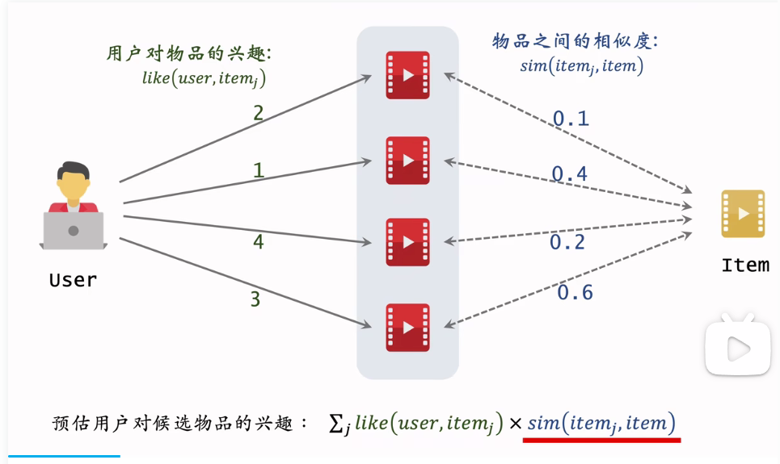
* **召回通道**：
(1) 维护两个索引：用户->top N物品，物品->top K物品
（2）线上做召回：利用索引，每次取回$nk$个物品，计算兴趣分数，返回最高的几个物品

* **物品的相似度**：两个物品**受众重合度高**，那么越相似，同时考虑到用户喜欢物品的程度
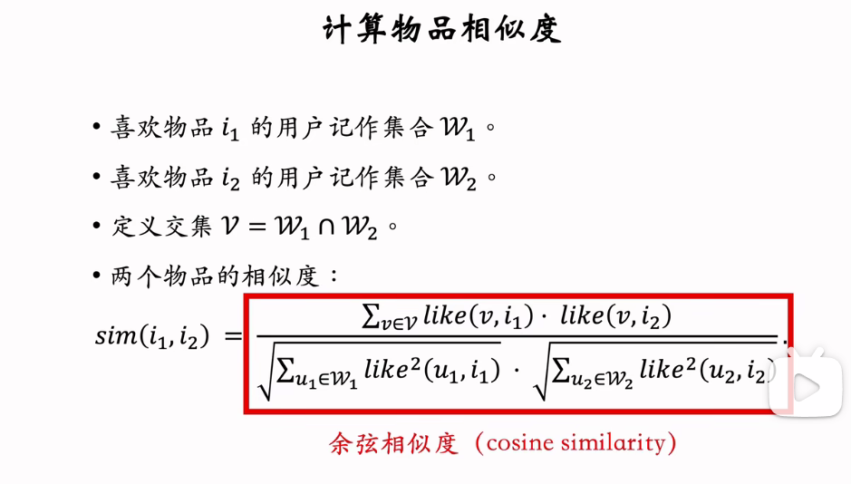
其中$V$代表同时喜欢两个物品的人群，$W_1$代表喜欢1物品的人群，利用**人群对物品的评分强度**，反应用户偏好，类似余弦相似度
* **ItemCF完整流程**
  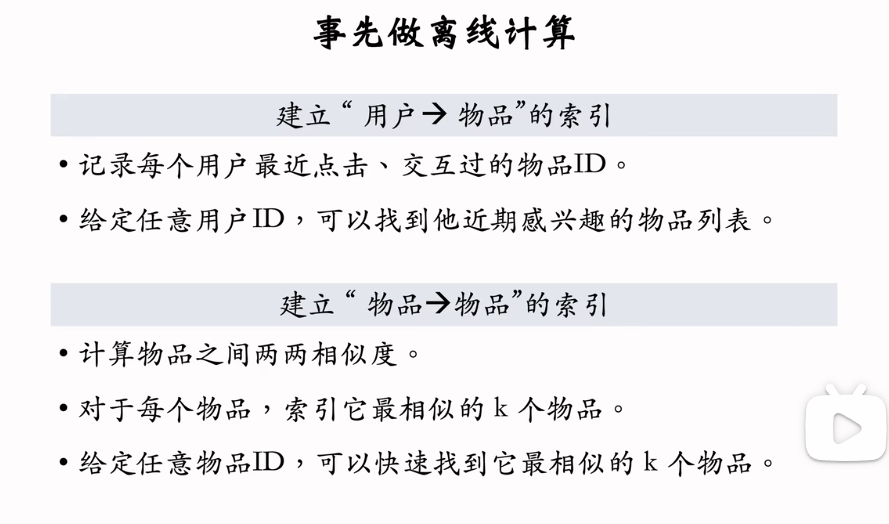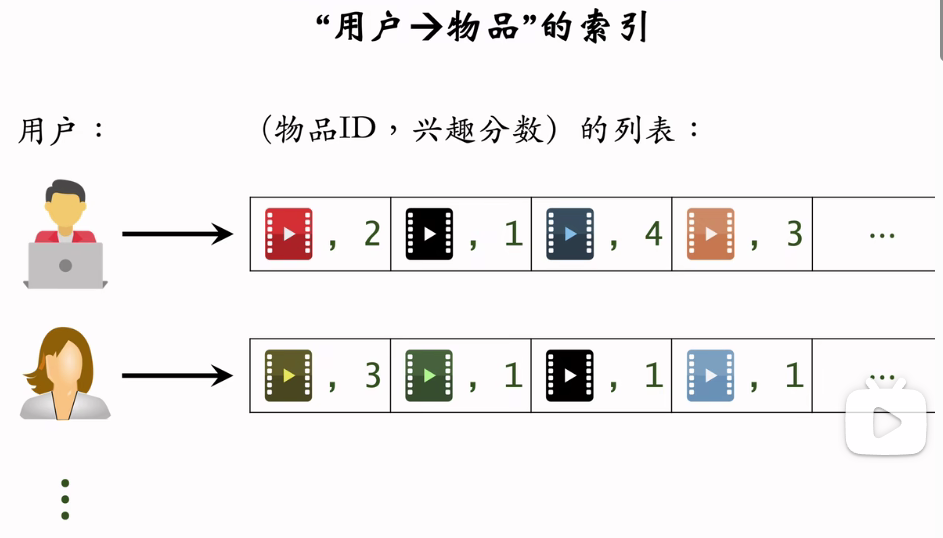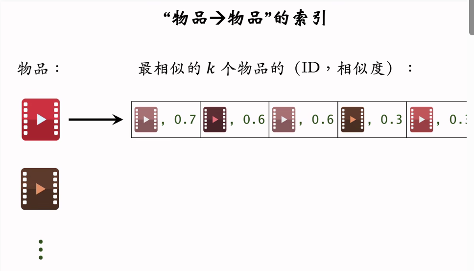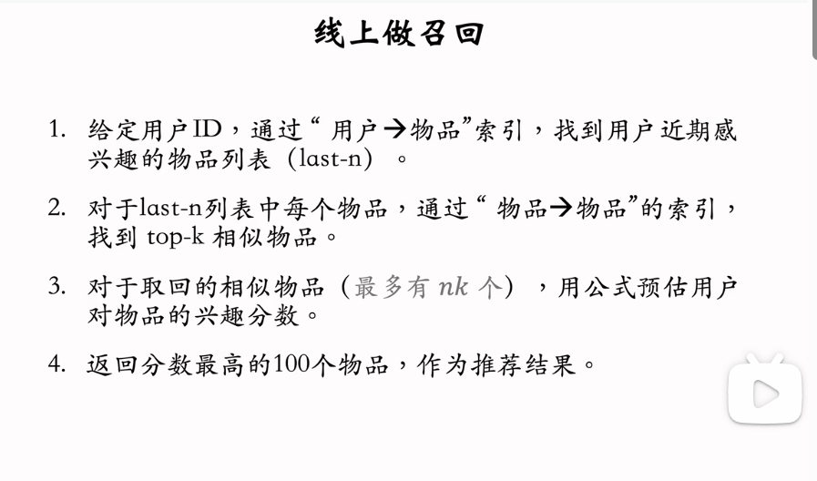
注意，离线计算量大（构建两组索引），线上计算量小。

### 2. Swing召回通道
* **ItemCF的不足**：小圈子用户会造成物品相似度高但实际相似度低。但实际中若一群不相关的用户同时交互两个物品，则说明两个物品相似度高。--> 给用户设置权重，解决小圈子问题
* **Swing与ItemCF的区别**：唯一区别是**如何定义物品的相似度**。首先定义用户的重叠度（将重叠度作为分布一部分，降低小圈子对相似度的影响），然后对人群做连加。
  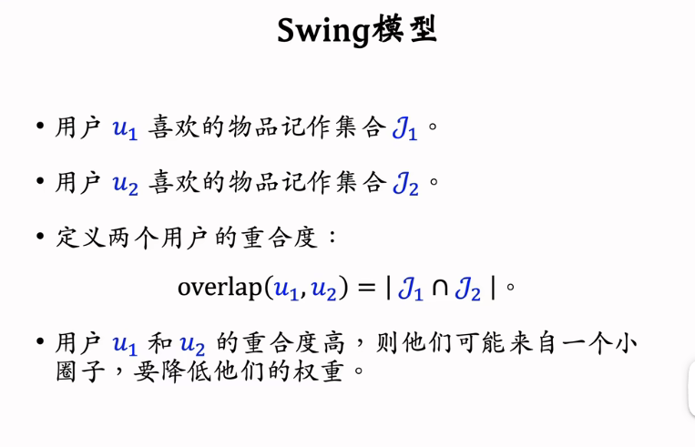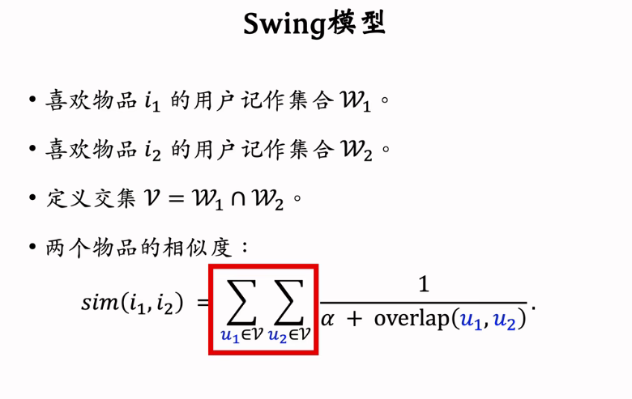
即 ItemCF：两个物品的重合用户比例高，则判定相似，Swing：额外考虑重合的用户是否来自一个小圈子
