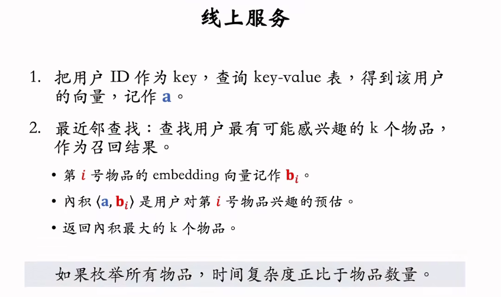
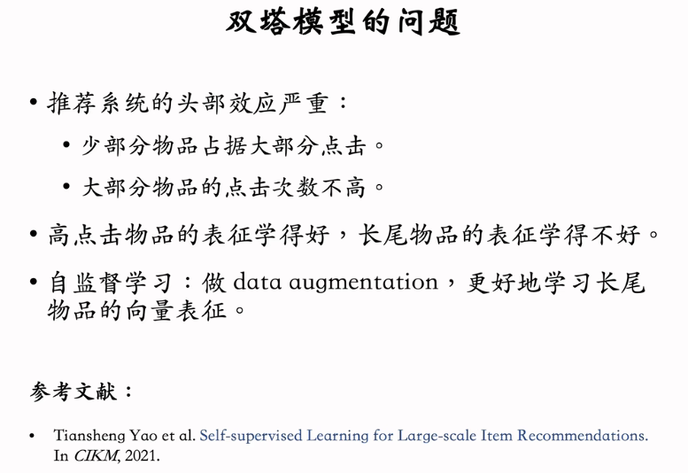
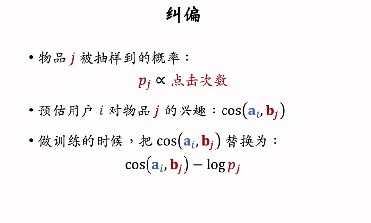
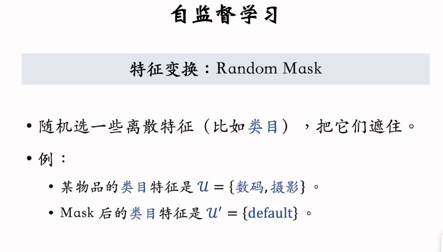
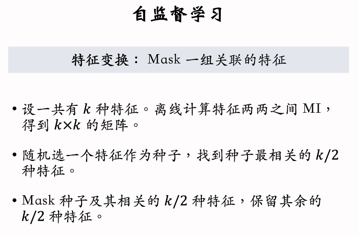
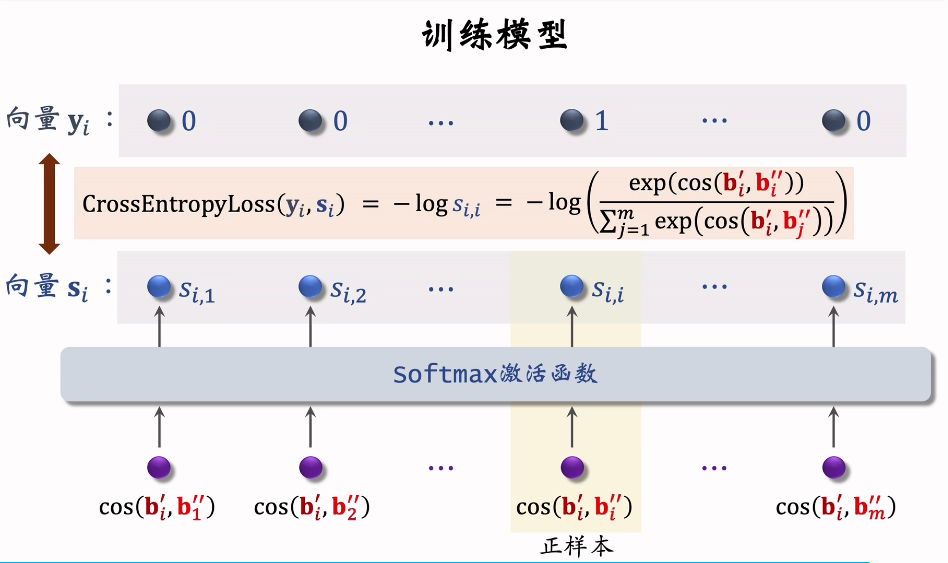

2015/10/6

# 4. 离散特征处理

* **处理过程：建立字典与向量化**：首先，把类别映射成序号。例如：中国 -> 1，美国 -> 2。 之后，把序号映射成向量，例如One-hot编码，Embedding（映射成低维稠密向量）

* **关于One-hot向量**：局限性：维度高（当物品类别数量太大时，通常不用one-hot）

* **Embedding**：参数数量:类别数量*向量维度。类别数量很大时，用Embedding
  

# 5. 矩阵补充、最近邻查找

* **矩阵补充**
* 1. 总体模型：
* 2. 训练过程：优化两个Embedding层参数，使输出的内积接近用户与物体的兴趣值

* 3. 为什么是矩阵补充？在真实数据中，大量物品没有曝光给该用户（灰色）。通过训练模型，可以预测用户对物品的兴趣度，从而进行推送。
 
* 4. 实践中效果不好：(1)只使用ID信息，没有利用其它的物品、用户属性信息 --> 双塔模型进行了升级 (2)负样本的选取方式不对。（负样本不应该是曝光后无点击的） (3)训练方法不好，内积不如余弦相似度，做回归不如做分类（用交叉熵损失，判断样本是正样本还是负样本）

* **线上服务**
* 1. 模型存储：

* 2. 线上服务：
  
--> 需要加速查找：近似最近邻查找（将向量划分成多个区域，建立索引）

# 6. 双塔模型——模型结构、训练方法
* **模型结构**：（注意使用了用户、物品的多个特征，双塔：用户特征塔、物品特征塔，两个塔分别输出一个向量，并且使用余弦相似度进行计算
  

* **训练方式**：具有以下三种。
  

  1. Pointwise训练：
   
  2. Pairwise训练 
 
  3. Listwise训练
   

# 7. 双塔模型——正负样本

* **正样本**：有曝光且有点击的样品，但很有可能热门物品占主导
* **负样本**：可能有多种情况
* 1. 简单负样本：未被召回的物品，大概率用户不感兴趣。
  * 1. 全体物品：由于召回的物品只占极少数，因此未被召回的物品≈全体物品。--> 直接从全体物品进行抽样得到简单负样本。问题是是不能均匀采样。 
  * 2. Batch内负样本：batch内负样本对于热门物品打击过大，需要进行修正
  
1. 困难负样本：被粗排淘汰的物品（比较困难）-> 分类中较易分错；通过粗排但精排分数靠后的物品（非常困难） -> 更易分错。
2. 最终的训练数据：多种负样本的混合

**易犯错误**：曝光但没有点击的样本不是负样本！注意，召回是分类用户可能感兴趣/不会感兴趣的样本，而不是区分感兴趣的程度（这是排序需要做的）

# 8. 双塔模型——线上服务、模型更新

* **线上召回**：首先**离线**使用模型计算物品的特征，然后存储**物品**特征向量到数据库，但对于**用户**特征，只有给定用户ID和特征时，才会在线上计算。然后将用户特征到向量数据库做最近邻检索，找到相似度最高的k个物品向量
  

 --> 为什么离线存储物品向量，线上计算用户向量？(1) 线上计算物品向量代价过大 (2)用户兴趣动态变化（需线上），而物品特征相对稳定（可以离线）

* **模型更新**：全量更新（用昨天所有的数据训练一次，更新全连接层等参数）与增量更新（每隔几十分钟即进行实时更新，但只更新用户ID Embedding层，供用户塔在线上计算用户向量）。增量、全量都要做，若只做增量，有可能小时级的数据有偏。全量训练效果更好，而增量训练有助于实时捕捉用户兴趣
  

# 9. 双塔模型+自监督学习

* **自监督学习的目的**：改进物品塔，更好地从低曝光物品中学习向量表征
  
  回顾Listwise训练过程：利用batch内负样本，但要进行纠偏
  

* **自监督学习思路过程**：对物品做变换，得到统一物品的不同特征，通过物品塔后得到了特征向量。同一物品的不同特征表示相似，不同物品的特征表示不相似
  

* **特征变换**：
* 1. Random Mask （整个类目特征都丢掉） 
* 2. Dropout（只丢掉一部分） 
* 3. 互补特征complementary（把特征随机分为两组，得到两组表征）
* 4. Mask一组关联特征（效果好但复杂、不宜维护）
    

* **训练模型**
  最终的训练过程：一部分在batch内样本做训练，训练整体模型；同时在整体数据集中抽样（抽样可以得到低曝光物品），然后做自监督学习，只训练物品塔。
  