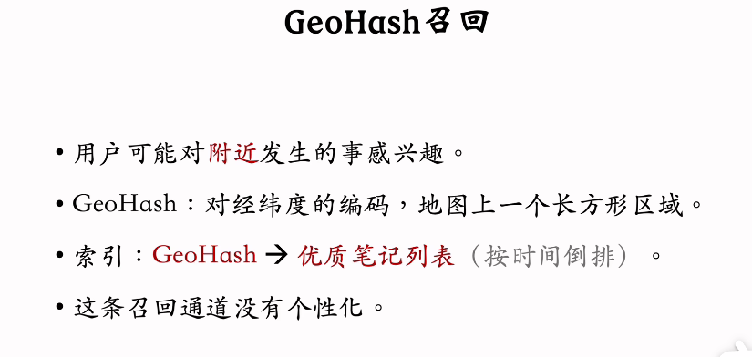

2025.10.7

# 10. Deep Retrieval召回

基本想法：Deep Retrieval把物品表征为路径 (path)，线上查找用户最匹配的路径

* **索引**：将物品与路径进行关联
* 1. 路径 -> 物品：训练神经网络时会用到。一个物品会对应多条路径，路径用一组节点表示。
* 2. 物品 -> 路径：线上召回时会遇到。一条路径对应多个物品。
  

* **预估模型**：给定用户特征，用神经网络预估用户对路径的兴趣。这样，可以根据用户特征召回多条路径。用神经网络分别预测对三层节点的兴趣，选择节点后加入到原始数据再次预测下一层。
  
  

* **线上召回**：用户 -> 路径 -> 物品。
* 1. 给定用户特征，用beam search（可以减少计算量）召回一批路径。其中超参数beam size越大，计算量越大。
* 2. 利用索引"path -> List(item)"，召回一批物品：查看索引"path -> List(item)"，每条路径对应多个物品
* 3. 对物品做打分和排序，选择子集。从索引召回的物品数可能超过K，需要进一步排序

* **训练**：（训练时只使用正样本）交替更新神经网络参数和物品的表征
* 1. 学习神经网络参数（学习用户-路径的关系）：假设一个物品可以表征为多条路径，如果是正样本，应该让用户对这多条路径的兴趣都变大。
  
* 2. 学习物品表征（学习物品 -> 路径的关系）：用户是物品与路径间的中介。关于损失函数，一方面要让物品与对应路径相关性高，另一方面避免一条路径上不能有过多物品（用贪心算法进行更新）
  

Deep Retrieval ：用路径作为用户和物品间的中介
双塔模型：向量表征是中介

# 11. 地理位置召回、作者召回、缓存召回

* **GeoHash召回**：一种地理召回。只考虑用户的地理位置，不考虑用户的兴趣（因此需要选择该区域的优质笔记）--> 哪些符合用户兴趣？后面的排序中决定
  

* **同城召回**：与GeoHash召回相似，但是用城市做索引
  

* **作者召回**：对关注的/有交互的/相似的作者发布的笔记感兴趣
  

* **缓存召回** 加入之前精排排名高但没有被随机选择的笔记。但需要设置退场机制
  

# 12. 曝光过滤 & Bloom Filter

* **曝光过滤**：过滤已曝光的物品，但需要不能够对每条召回的物品进行与已曝光物品暴力对比，太耗时 --> 用Bloom Filter
  

* **Bloom Filter** 不可能把已曝光的物品误判为未曝光，但有可能把未曝光的物品误判为已曝光。
  