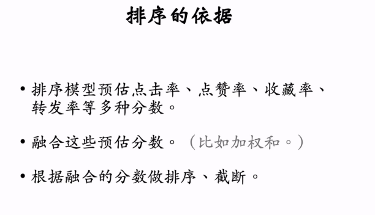
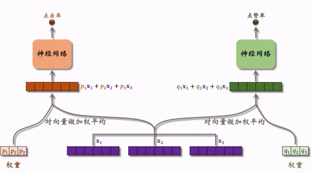
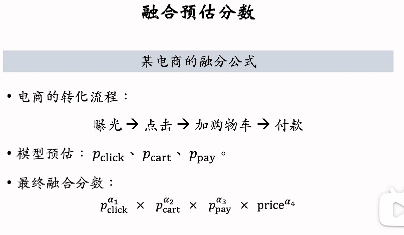
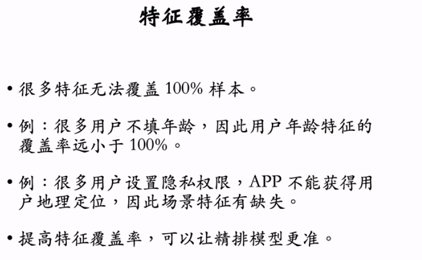
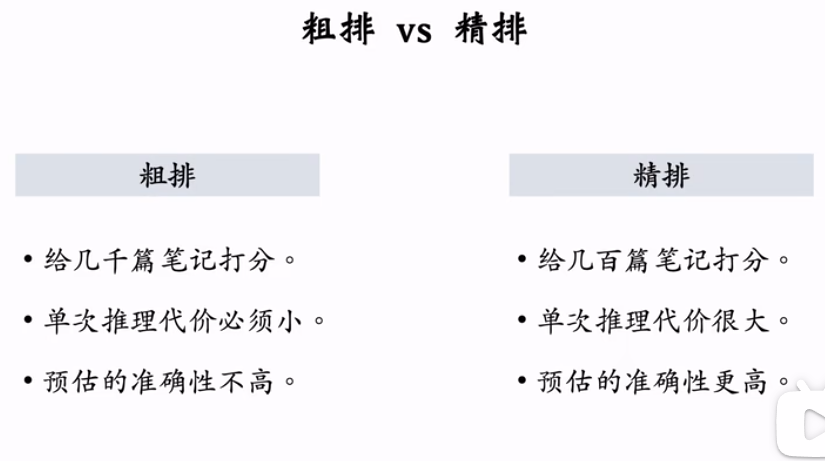
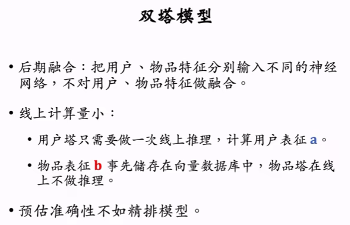

# 1. 多目标模型

粗排与精排相似- 不过粗排模型小，只做简单的初步筛选- 精排模型更大，用到的特征更多。

* **排序的主要依据**：预估用户对笔记的兴趣（多项指标），然后融合这些分数
  

* **多目标模型**：融合多个特征，同时预测多个指标
  

* **多目标模型的训练** 使预估的点击点赞等分数接近真实值 （是否点击点赞）， 仍看作二元分类｡ 但存在的问题是：**类别不平衡**，需要对负样本进行降采样｡ 既可以处理类别不平衡，也可以减少训练样本，加快训练时间

* **预估值校准：**负样本减少带来的预估点击率高于真实值｡ 最后用校准后的预估值进行排序
  

# 2. Multi gate Mixture of Experts(MMoE)

* **MMoE**:：对多个神经网络输出的向量做加权平均。当需要预测多个指标时，就需要有多组权重，对向量左加权平均
  

* **极化现象**：权重softmax输出接近0-1，导致可能只集中使用某几个专家（其余专家“死掉”）
  

* **解决极化现象**：对权重的输出dropout（如果本来权重针对某一专家接近1，被mask后效果很差 -> 神经网络会避免某个输出元素接近1）
  

# 3. 预估分数的融合

简单加权求和
  
  使用排名
  
  

# 4. 视频播放建模
* 视频的排序与单纯的笔记不同，播放时长和是否完播是很重要的指标。

* **播放时长**:对于播放时长的训练，对输出$z$经sigmoid变换后使用交叉熵损失计算，而在推理时只用$exp(z)$作为市场的预估。这是因为当损失为0时，时长$t = exp(z)$

* **视频完播** 预估完播率，可以用回归或者分类。但是实际中，收到视频时长的因素，完播率不能直接加入到融分公式（时长越长，一半完播率越低）
  

# 5. 排序模型的特征

* **用户画像(User Profile)**：ID，性别，账号，类目等
  

* **物品画像(Item Profild)**：其中内容信息量、图片美学，是事先用人工标注的数据训练CV NLP等模型，然后新笔记发布时用模型对笔记打分
  

* **用户统计特征**：用户最近不同时间粒度的行为（可以体现出用户的短期、长期兴趣）、对视频/图文 或 不同类目的偏好
  
* **笔记统计特征**：不同的时间粒度、受众、类目偏好
  

* **场景特征(Context)**：
  

* **特征处理**：离散特征做Embedding，连续特征：(1)分桶变离散 (2)其它变换
  

* **特征覆盖率**：有的数据特征缺失。需要考虑提升覆盖率以及当缺失时填补的默认值
  

* **数据服务**：物品画像存储压力大，且偏静态；统计数据动态变换，时效性强
  

# 6. 粗排
* **粗排与精排的区别**

* **精排模型与双塔模型**：精排模型做前期融合，将所有特征放入神经网络。这个神经网络很大，每次推荐要对n个笔记都进行推理，推理代价大。双塔模型是物品塔输出向量后进行融合，每次推理不需要再对物品塔做计算，线上只推理用户塔，因此每次推理虽然有多个笔记，但只需要推理一次用户塔。推理代价小，适合做召回
  

* **粗排的三塔模型** 介于前期融合与后期融合之间，三塔模型的计算量主要是上层的全连接层。
  