2025/10/14

# 涨指标的方法
## 1. 概述
* **推荐系统的评价指标**：
* 1. **日活用户数（DAU**和留存是最核心的指标
* 2. 工业界常用**LT**7， LT30，LT的增长通常意味着用户体验提升：LT7是包括今天在内的未来7天，登录APP的次数。所有用户LT7的平均即为整个APP的LT7得分。
* * 特例：LT上升但DAU下降（赶走了不活跃的用户），应该确保DUA不下降
* 3. **其它核心指标**：用户使用时长，总点击数、总曝光数。（时长增长，LT一般上升，但阅读数、曝光数可能减小（长视频过多））
* 4. **非核心指标**：点击率、交互率，重点关注核心指标，非核心指标下降也没有关系
* 5. 对于UGC平台，发布量和渗透率也是核心指标

* **涨指标的方法**
* 1. 改进召回
* 2. 改进粗排和精排
* 3. 提升召回、粗排、精排中的多样性
* 4. 特殊对待新用户、低活用户等特殊人群
* 5. 利用关注、转发等交互行为

## 2. 召回
**召回模型与召回通道**
* 1. **召回总量固定** 推荐系统有几十条召回通道，但总量确定。总量越大，指标越好，但计算量越大
* 2. **双塔模型和item-to-item**是最重要的两类召回模型，占据了大部分配额
* 3. 其它的**小众模型**配额少，但同样对核心指标有提升
* 4. 添加**内容池**：例如30天物品、1天物品、新用户优质内容池等。同一个模型可以同时用于多个内容池（例如只训练一个双塔模型，就可以同时用于多个内容池，得到多个召回通道）
*************
**双塔模型的改进方向**最重要！
* 1. **优化正负样本**：简单正样本（有点击的用户、物品二元组），简单负样本（随机组合的二元组）、困难负样本（排序靠后的二元组）
* 2. **改进神经网络结构** Baseline：用户塔物品塔都是全连接网络  改进：用更高级网络，例如DCN。或者**加入用户行为序列**lastn。同样还有**使用多向量模型代替单向量模型**。
  * * 使用**多向量模型**代替单向量模型： 标准的双塔模型也称为单向量模型，两个塔各输出一个形状相同的向量。而多向量模型的用户塔输出多个向量，物品塔只输出一个。对于多个向量，可以分别与物品向量计算点击率、点赞率等。
  * * 单向量模型计算相似度，进行二分类（正负样本）；而多向量模型同时**预估多个指标**。通过只对物品塔计算一个向量，（要存入数据库），可以减少储存需求。
    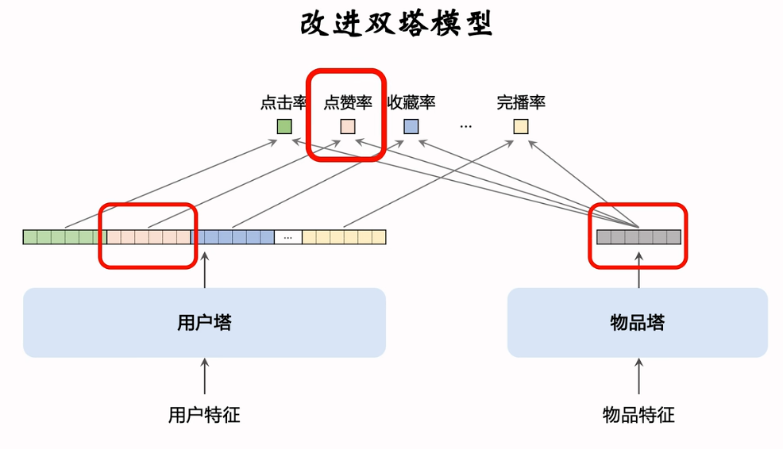

* 3. **改进模型的训练方法**：Baseline：做二分类，区分正负样本
  *  * 思路1： 结合二分类、batch内负采样（纠偏）
  *  * 思路2：自监督学习，让冷门物品的embedding学的更好

*************
**Item-to-Item的改进方向**很重要！
Item-to-Item是一类模型，基于相似物品做召回
* 常见用法：**U2I2I** (User -> Item -> Item): **基于物品相似度做推荐**。首先已知用户u喜欢物品$i_1$ -> 寻找相似物品$i_1$与$i_2$相似， 即I2I -> 将$i_2$推荐给用户u
* 如何计算**物品相似度**：
  * 1. ItemCF及其变体：依靠用户的行为。若用户同时喜欢$i_1$, $i_2$，则认为两物品相似。类似模型ItemCF, Online ItemCF, Swing, Online Swing。**同时使用该四种模型，分配一定配额**。
  * 2. 基于物品向量表征，计算向量相似度。双塔模型等均可以计算向量表征
  
**********
**小众的召回模型**
* 关于**U2U2I** (User -> User -> Item)：**基于用户相似度做推荐**：知用户$u1$与$u2$相似,且$u2$喜欢物品$i$,那么给用户$u1$推荐物品$i$。
* 关于**U2A2I** (user→author→item): **基于用户与作者的关系**已知用户$u$喜欢作者$a$ > 且$α$发布物品$i$,那么给用户$u$推荐物品$i$。
* **U2A2A2I**(user→author→author→item):**基于作者间的相似度**已知用户$u$喜欢作者$a1$,且$a1$与$a2$相似,'$a2$发布物品$i$,那么给用户$u$推荐物品$i$。
  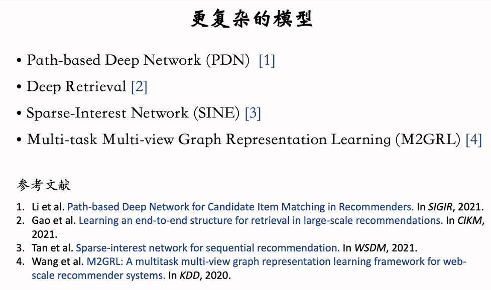

## 3. 排序模型

**精排模型的改进**
回顾精排模型：精排模型的**基座**和**多目标预估**都可以改进。
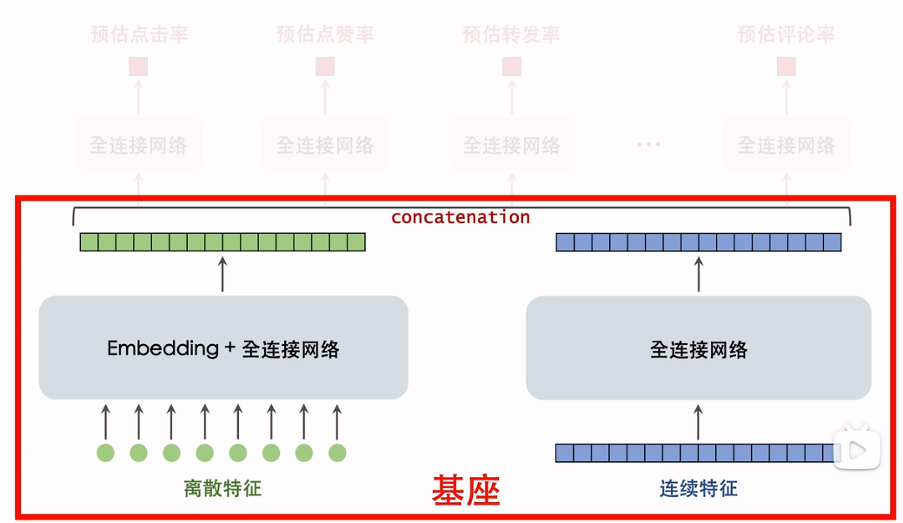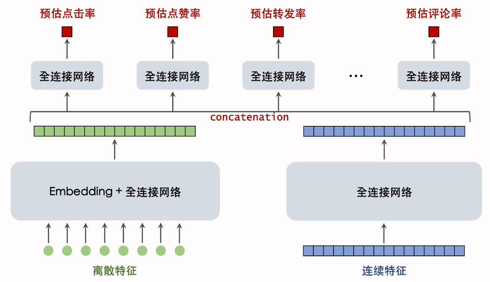

* **基座的改进**：基座的输入包括离散和连续特征，输出的向量用于多目标预估
  * 改进1：基座（全连接网络）加宽加深。大部分的参数量都在Embedding层，实际中全连接网络的参数量很小。全连接网络一般1-6层
  * 改进2：做自动的特征交叉，例如bilinrea, LHUC
  * 改进3：特征工程，例如添加统计特征、多模态内容特征

* **多目标预估的改进**：多目标预估是基于基座的输出向量，同时预测点击率等多个目标
  * 改进1：添加新的预估目标，把新的预估目标加入融合公式。（例如是否进入评论区、给评论区评论点赞）
  * 改进2；MMOE PLE等模型结构，往往无效
  * 改进3：纠正position bias，但往往无效 

************
**粗排模型的优化**
粗排的打分量比精排大很多，因此需要够快。
* **改进模型结构**往往使用**简单模型**：例如多向量双塔模型，同时预估点击率等多个指标。复杂模型效果好（例如三塔模型），但实现难度大
* **粗精排一致性建模** 蒸馏精排模型（更复杂）来训练粗排模型（简单小魔仙），让粗排精排更一致，可以提升一致性建模。缺点：若精排出问题，会影响污染粗排
  * 1. pointwise蒸馏：粗排的拟合目标不仅是用户真实行为，还加入了精排的预估。设用户真实行为$y$, 精排预估为$p$，则粗排的拟合目标是$\frac{y+p}{2}$
  * 2. pairwise或者listwise蒸馏：给定$k$个物品，根据精排预估做排序，然后做learning to rank(LTR)，让粗排拟合物品的序（而不是值）

**********
**用户行为序列建模**
回顾用户行为序列：对lastn物品做embedding，得到n个向量，对n个向量做平均，得到的一个向量即可作为用户的一种特征。
* **DIN**：不再简单平均，而是使用**注意力机制**，对物品向量做加权平均。目前工业界沿着SIM方向发展，先按照类目属性筛选物品，然后用DIN做加权平均
  * 1. 改进1：**增加序列长度**，让预测更准确，但会增加计算成本
  * 2. 改进2：**改进筛选方法**：目的是降低序列长度。除了用类目，还可以用**物品向量做聚类**：离线提取物品特征，表征为向量，对向量做聚类，每个物品对应一个聚类编号。在排序时，对用户行为序列中的n个物品，只保留聚类序号与候选物品相同的物品。可以同时进行多种筛选方法，取并集。
  * 3. 改进：对用户行为序列中的物品，**使用ID以外的一些特征**。
  
**************
**在线学习**
回顾：全量更新和**增量更新**。（增量更新即在线学习）关于**资源消耗**：即需要在凌晨做全量更新，也需要全天不间断做增量更新。同时因为线上在做AB测试，同时有多个模型（其中1个holdout 1个推全），都需要做在线学习，就需要多套算力。
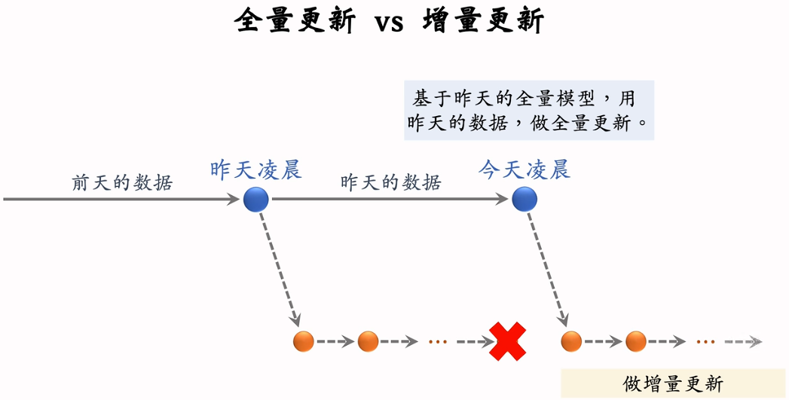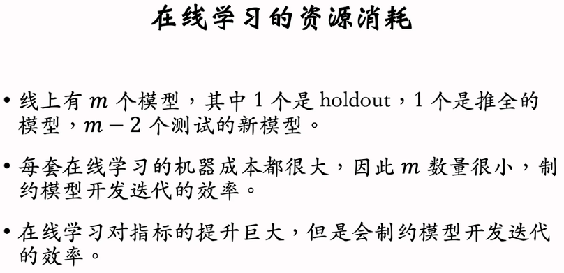

**********
**老汤模型**
* 老汤模型的产生：由于每天都用新数据对模型做训练，久而久之老模型训练的非常好，很难被新模型超过。
  * 问题1：如何判断新模型结构是否由于老模型？是否值得继续训练？（只需要知道是否更优，本来就很难追上，不需要追上）
  * 问题2：如何更快追平、超过线上的老模型？（新模型只用几十天的数据，而老模型已经训练了几百天）

* **判断谁更优**：
  * 1. 相同初始化：对于新老模型的全连接层都随机初始化，Embedding层可以随机初始化，或者都复用老模型的参数（保证参数一致， 区别只在模型结构）
  * 2. 相同数据训练：用n天数据训练新老模型（n较小，因此实验很快）
  * 3. 若新模型显著更优，则表明可能更优
  
* **如何能够更快追平**：
  * 1. 尽可能多服用老模型训练好的embedding，避免重新随机初始化（Embedding比全连接层学得慢）
  * 2. 用老模型做teacher，蒸馏新模型（$p$是老模型预测，$\frac{y+p}{2}$作为新模型的训练目标）

## 4. 多样性
提升召回、粗排、精排的多样性

* **排序的多样性 -- 精排**
  * 在精排阶段，要结合兴趣分数与多样性分数对物品做排序
  * 常用MMR DPP等方法计算多样性得分，注意，**精排使用滑动窗口，粗排不使用滑动窗口**。（因为精排决定最终曝光，而曝光的临近物品相似度应该小，保证同一个滑动窗口内物品差异性大；而粗排要考虑整体的多样性）
  * **打散策略** 通过类目、多模态向量表征（再做聚类）等，要求后面选择的k个物品与当前物品不能属于一个类

* **排序的多样性 -- 粗排**
  * 物品分两部分：
    * 1. 第一部分重点考虑兴趣分数：粗排对5000个模型打分，直接将分数（兴趣分数）最高的200个送入精排
    * 2. 第二部分综合兴趣分数和多样性：对于剩余的4800个物品，综合兴趣得分与多样性分数，进行排序，送入300个物品

* **召回的多样性**
  * 1. **双塔模型：添加噪声** 在线上用用户向量向物品向量做检索之前，向**用户向量中添加随机噪声**。用户兴趣越窄（比如lastn物品只有几个类目），则添加噪声越强
  * 2. **双塔模型：抽样用户序列** 保留用户最近交互的$r$个物品 ($r << n$)，对于**剩余$n-r$个物品做抽样**，得到$t$个（可以均匀也可以非均匀），将抽样得到的$r+t$个物品作为用户行为序列。这样可以注入随机性，召回结果更多样；同时增大$n$，覆盖更久兴趣，但由于抽样，计算代价不会增加
  * 3. **U2I2I：抽样用户行为序列** 第一个item是用户的lastn序列，称为**种子物品**。种子物品可能类目少、不平衡。--> 做非均匀随机抽样，使得类目平衡，用抽样物品作为种子物品。同样的，这样增大n，也不会增加计算，但类目会更多

* **探索流量**
  每个用户的曝光物品中，有一部分是非个性化的（但高质量），用作兴趣探索。
  例如，维护一个精选内容池（可以分人群，但都是高质量的），之后随机抽样几个，跳过排序，强插（用户之前基本没交互过，排序不占优势）。
  短期内可能会对核心指标有负面影响，但长期会有正向影响。

## 5. 特殊用户人群
新、低活用户历史行为少，难以进行准确推荐；容易流失，希望能够留存（只需要考虑留存，不考虑其它指标）；行为与老用户不同（点击率、点赞率等）
*************
**构造特殊内容池，用于特殊用户人群的召回**
  * 原因：新、低活用户的个性化推荐做不好，用高质量物品弥补不足；针对特殊人群根据兴趣构造特殊内容池
  * **关于构造特殊内容池**
    * 1. 方法1：根据颦获得的交互次数、交互率选择优质物品。首先要圈定人群的点击点赞等，构造优质内容池，定期更新。该内容池只对特定人群有效
    * 2. 方法2：使用因果推断，判断物品对人群留存率的贡献，选出优质物品。
  * **关于特殊内容池的召回**：
    * 1. 通常使用双塔模型从特殊内容池中做召回。对于新用户，个性化不够准，但内容高质量，可以弥补模型的不准
    * 2. 训练代价：对于正常用户，不管多少内容池，只训练一个双塔模型。新用户单独训练一个双塔模型（同样不管内容池的多少）
    * 3. 但会增加推理代价：离线更新ANN索引，线上做召回，都需要算力。每增加一个内容池，算力就要增加一份。但由于特殊内容池都很小，所以需要的额外算例不多
*******************
**特殊的排序策略**
* 1. **排除低质量物品**。对于新用户，只关注留存，不关注消费（曝光、广告等），因此对这些用户少出广告，甚至不出广告。同时冷启动（新物品）不在新用户上做探索，避免伤害用户体验，只在老用户上做探索。
* 2. **差异化的融分公式**。新用户的点击、交互行为与正常用户不同，人均点击量很小。在融分公式中，可以 提高低活用户的点击率的权重，降低点赞率等，以促使用户点击物品。或者，保留几个曝光坑位给预估点击率最高的几个物品，甚至将点击率最高的物品放在第一，确保一定能被看到
*****************
**特殊的排序模型**
* 为什么需要差异化的排序模型：
  * 1. 特殊人群的行为（点击率、交互率）等不同于普通用户
  * 2. 排序模型以主流用户占主导，因此使用排序模型对新用户做预测有偏差
* **法1：大模型+小模型**
  * 用全体用户行为$y$训练大模型，记大模型预估为$p$，用特殊用户行为训练小模型（拟合大模型的残差$y-p$，纠正偏差）
  * 主流用户只用大模型做预估。特殊用户结合两个模型.
* **法2：融合多个experts，类似MMoE**
  * 只用一个模型，但模型有多个experts，各输出一个向量
  * 对输出向量做加权平均
  * 权重由用户特征计算得到（例如，根据用户的新老活跃度作为特征，计算权重）
* **法3：大模型做预估后，用小魔仙做校准**
  * 先用大模型预估点击率、交互率（是用全量数据训练的，但对特殊用户的预测不准确）
  * 用小模型（可以很小，如GBDT）做校准：将用户特征、大模型的预估作为小模型输入，只在特殊人群中训练，拟合用户真实行为。（再做一次预估，纠正）
  * 错误的做法：每个用户人群使用一个排序模型，同时维护多个大模型。但维护代价大！最好只有一个同一的模型，再加几个小模型做校准
  
## 6. 交互行为（关注、转发、评论）

* 推荐系统如何利用交互行为：简单做法：将预估的交互率用于排序。将交互行为作为预估目标，将预估的交互率等做融合，做排序的依据

**关注**
1. 用户的关注作者越多，则平台对其吸引力越强。用户留存率$r$与关注作者数量$f$正相关。
2. **如何利用关注关系提升关注量？**
   1. 方法1：**用排序策略提升关注量**。当$f$很小时，$w(f)$作用明显，会提升预估$p_i$大的物品的得分，促进关注
   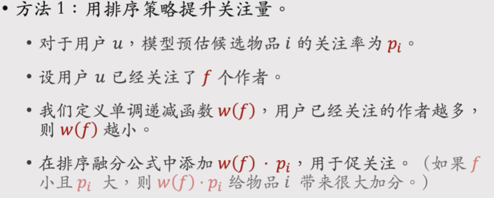
   2. 方法2：**构造粗关注内容池和召回通道**
   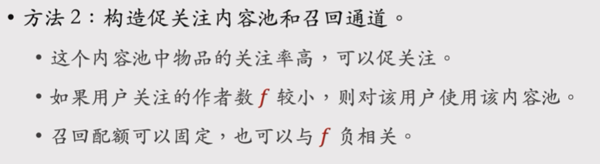

3. **粉丝数**
   1. 希望能够激励发布作者的积极性。作者的粉丝数越少，则每增加一个粉丝对发布积极性的提升越大。
   2. **用排序策略帮助低粉新用户涨粉**：作者粉丝数越小，那么在排序公式中，给作者增加大的权重，帮助其曝光涨粉
      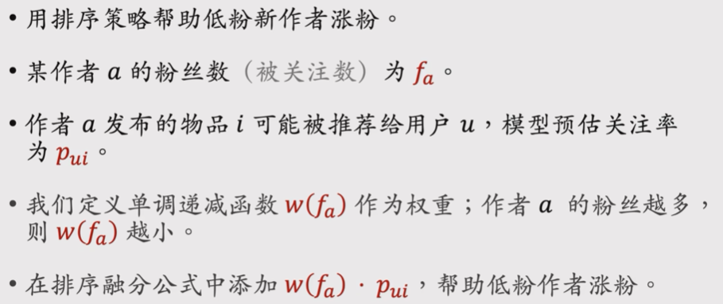

4. **隐式关注关系**：用户喜欢看某作者的发布内容，但是没有关注。希望可以挖掘隐士关注关系。
*******
**转发**
希望可以促进转发，分享回流，吸引站外流量，提升DAU和消费指标。
注意，不能简单提升转发次数，增大转发率在融分公式中的权重，可以促进转发，但会伤害其它指标。
目标：在不损害点击和其它交互的前提下，多吸引站外流量。
* **KOL建模**
  * **其它平台的KOL**的转发可以吸引大量站外流量。KOL指Key Opinion Leader，即大V
  * **如何判断本平台的用户是不是其它平台的KOL**分析该用户的历史转发能带来多少站外流量
  * **利用KOL用于排序和召回**
    * 方法1.排序融分公式中添加额外一项$k_u*p_{ui}$ :用户是站外KOL，则$k_u$大。$p_{ui}$为模型预估的转发率。即如果用户是KOL，则多为其曝光其可能转发的物品。如果不是，则$k_u4接近0，不会影响排序。
    * 方法2：构造促转发内容池和召回通道，对站外KOL生效
*******
**评论**
1. 评论的作用之一：**促发布**，提升作者发布积极性。如果新发布物品尚未获得很多评论，则给预估评论率提权，让其尽快获得评论。
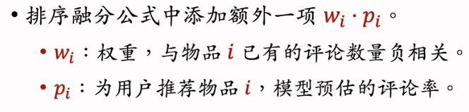
2. 其它作用：
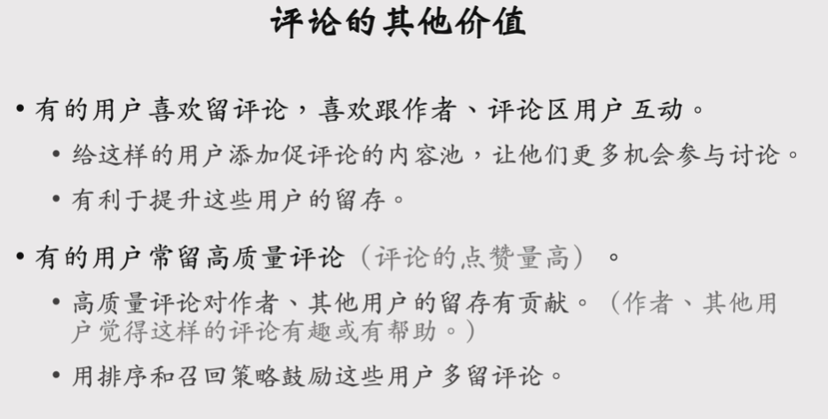