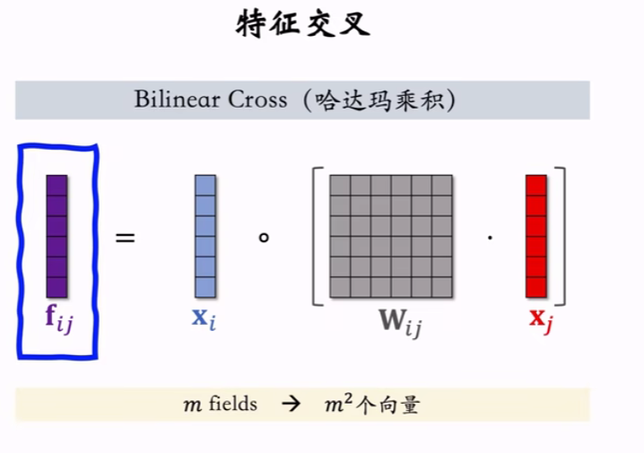
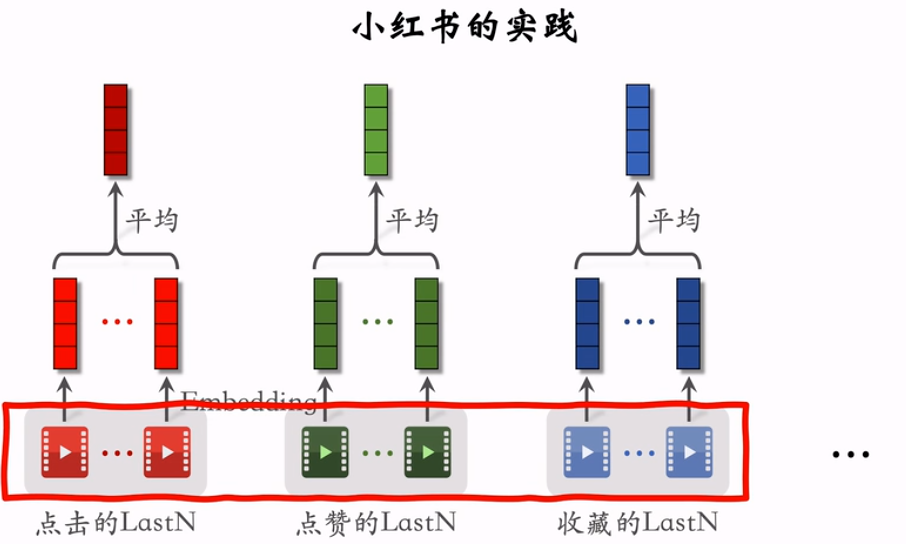

2025/10/10

# 特征交叉
## 1. Factorized Machine (FM) 因式分解机

（早些年常用）

* **线性模型**：没有进行特征间的交叉，只是简单加权求和
  

* **Factorized Machine：加入二阶交叉特征**：在线性模型基础上加入了两个特征的相乘（交叉），可以提升模型的表达能力。但当特征数量太大时，参数量太大，易有过拟合
  

* --> 如何减少特征数量？对矩阵$U$做近似
  

## 2. 深度交叉网络 (DCN)
DCN既可以用于排序，也可以用于召回（替换其中的深度学习模型）

* **回顾召回与排序**
  召回：两个塔可以是任意模型，最简单是全连接
  
  排序：中间的神经网络一样，可以用任意模型
  

* **DCN之交叉层 (Cross Layer)** 类似深度学习中的Resnet跳跃链接，每个交叉层的输出综合了最原始的输入、神经网络的输出、神经网络的输入
  

* **交叉网络 (Cross Network)** 多个交叉层组合在一起
  

* **深度交叉网络 (Deep & Cross Network, DCN)** ：交叉网络和全连接神经网络连接起来
  

## 3. LHUC (PPNet)
与DCN思路类似，但只能用于精排，起源于语音识别。

* **语音识别中的LHUC**：Sigmoid * 2可以放大一些特征、缩小另一些特征
  

* **推荐系统排序中的LHUC**：特征变为物品特征、用户特征
  

## 4. SENet 和 Bilinear 交叉

* **SENet**：离散特征做嵌入后，进行一系列的变换（权重），用权重与**原始嵌入做加权**，让重要特征权重更大。因为一开始对嵌入做了AvgPool，因此嵌入的向量维度可以不同
  

* **Field间特征交叉**
  Bilinear Cross有内积和哈达玛积两种形式。内积：考虑到参数量，需要人工选择哪些特征进行交叉，而不是全部。哈达玛乘积：最终concat后的向量维度太大了，也要选择哪些特征。
  

* **FiBiNet**：结合SENet和Bilinear Cross:对得到的嵌入既做Bilinear Cross，也做SENet，得到多个特征向量，concat后结合连续特征输入模型。
  

# 行为序列

## 1. 用户历史行为序列建模
用户的last-n特征表示最近交互过的n个物品，是重要的一个用户特征

* **简单平均**：对多个物品做Embedding后，将嵌入取平均
  

## 2. DIN模型（注意力机制）
也是对 LastN 序列建模的一种方法，效果优于简单的平均。DIN 的本质是注意力机制（attention）（用注意力的加权平均代替平均，权重代表物品与候选物品的相似度）
* 分别计算每个last n物品与候选物品的相似度，作为权重，求lastn物品的加权和，作为特征

* **本质：注意力机制**注意，DIN需要物品特征，不能用在双塔/三塔模型
  

## 3. SIM模型（长序列建模）
主要目的：保存用户的长期兴趣

* **DIN模型的缺点**：由于计算量的限制，只能关注短期兴趣（用户行为序列太短）
  

--> 改进DIN：保留长期行为序列，且计算量不过大。（从lastn中快速排除与候选物品无关的物品，只计算相关物品）

* **SIM模型**: 查找（寻找相关lastn） + 注意力机制（计算相似度）
  

* 1. **查找**：有两种方法。尽管Soft Search效果好，但Hard Search对计算需求更小
  

* 2. **注意力机制**：与DIN的区别是LAST-N变成TOP k。注意，在这里使用时间信息（物品的特征由物品embedding与时间embedding concat得到），效果会更好。
  
  为什么SIM使用时间信息，而DIN不需要？DIN只记录近期行为，而SIM记录长期
  