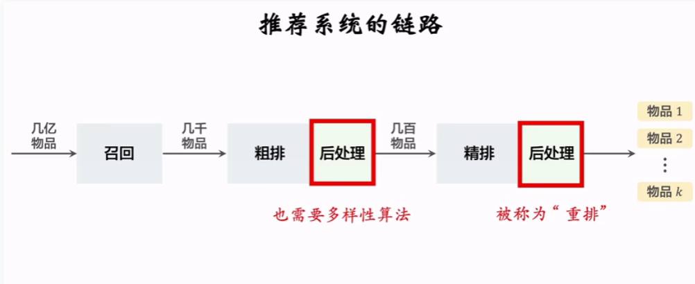
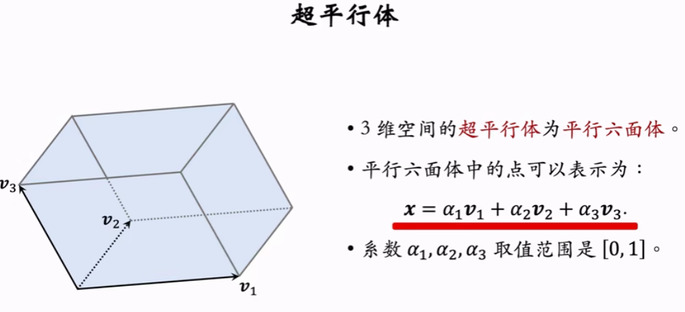
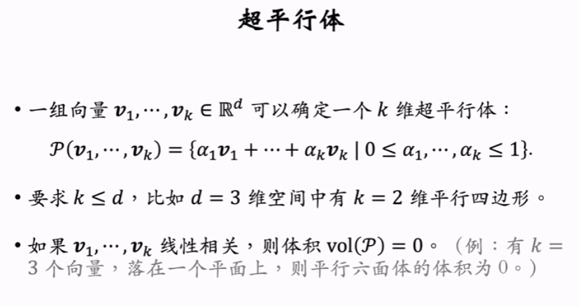
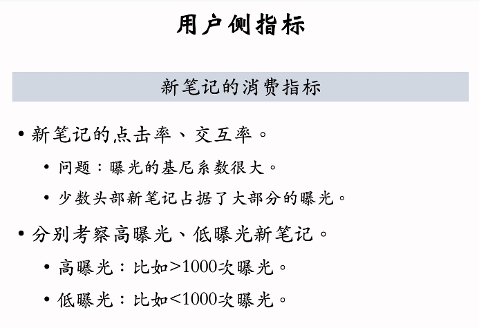

2025/10/11

# 重排

## 重排1：物品相似性的度量、提升多样性的方法
如果曝光给用户的物品两两之间不相似，说明具有多样性

* **相似性的度量**：基于物品的属性标签，或者物品向量表征。
* 1. 基于物品属性：物品的属性标签一般是由CV NLP算法由内容推断得到的。
* 2. 基于物品向量表征：如果将双塔模型学习到的表征用在多样性问题中，效果不好：因为推荐系统的头部现象严重，双塔模型学习不好向量表征，处理不好新物品、长尾物品。 --> 更好的是基于图文内容的物品表征。
  
3. 基于图文内容的物品表征：存在的问题：如何与训练CV NLP模型 --> 采用CLIP与训练
   

* **提升多样性的方法**
  在粗排与精排后添加后处理，采用多样性算法，既要选择得分高的物品，也需要有多样性。其中，精排的后处理也称为重排。
  

## 重排2：MMR 多样性算法（Maximal Marginal Relevance）

* **多样性**：需要基于得分reward与不同物品间的相似性sim，决定物品最终的曝光顺序

* **MMR多样性算法**：给未选中的物品打分（考虑reward和相似性），每一轮需要对未选中的所有物品重新打分，从中选择得分最高的，将其加入选入的集合。
  

* **滑动窗口**：由于在计算MMR得分时，用到物品i与所有已选中物品j的相似度。当j很多时，难以找到都不相似的物品。 --> 用滑动窗口代表所有已选中的物品，每次只看与最近选中的10个物品的相似性。

即没有必要让物品与第30个物品都不相似，可能只需要与最近的10个不相似
  

## 重排3：业务规则约束下的多样性算法

* **重排的规则** 规则优于多样性算法
  

* **MMR + 重排规则**：在用MMR选物品前，先用规则排除一部分物品（从删除后的子集选择物品）
  

## 重排4：DPP 多样性算法（上）
行列式点过程 (determinantal point process, DPP) 是一种经典的机器学习方法，DPP 是目前推荐系统重排多样性公认的最好方法。
* **数学基础之超平行体**
  

  超平行体定义：要求确定超平行体的向量线性无关
  

   --> 衡量物品的多样性：利用体积最大化，用矩阵表示的话，体积就是行列式的值，可以用行列式衡量物品多样性
   

## 重排5：DPP 多样性算法（下）

* 回顾：多样性问题

* **DPP基本思想**：用行列式衡量物体多样性 --> 主要贡献：如何快速求解（难点在于计算行列式）？使用贪心算法，每一轮选择物品$i$，希望添加的物品$i$能让$A$的行列式尽可能大（物品i不能和物品中任何物品相似）
  

* **求解DPP**：使用贪心算法暴力求解总时间复杂度高。其中求解矩阵$A$的复杂度是$O(n^2d)$，求解行列式的复杂度是$O(NK^4)$
 
* hulu 的快速算法：利用了矩阵的Cholesky分解，避免了行列式的大部分计算。若已知$A_s$的Cholesky分解，那么当给定新的行列时，不需要重新计算分解，可以快速计算有变换的地方，快速计算行列式。
  

* **DPP的扩展**
* 1. 滑动窗口用于DPP：与MMR中的滑动窗口类似，只计算未选中物品与最近选中的一部分物品（滑动窗口）中的相似性。
  
* 2. 规则约束：算法只能选择满足规则的物品，因此先利用规则删除不符合规则的物品，再进行求解。
  

# 冷启动

## 冷启01：优化目标 & 评价指标
是整个推荐系统中最困难的一环，主要研究UGC（user generalized context）的物品冷启动

冷启动很重要：新笔记缺少交互、低曝光，难以进行推荐，需要扶持新笔记

* **优化冷启的目标**：精准推荐，激励发布，挖掘高潜
  

* **评价指标**：作者侧（反应作者的发布意愿）、用户侧（反应推荐是否精准，是否会引起用户反感）、内容侧（能否发掘优质笔记）

* 1. 作者侧指标：发布渗透率（不考虑发布多少篇，只要发布就计入）与人均发布量
  
* 2. 用户侧指标：新笔记的消费指标（是否符合用户兴趣，为了避免头部效应的影响，分别考察高低曝光笔记的指标，重点关注低曝光），大盘消费指标（不区分新旧指标，确保新策略下大盘指标不会变差，基本持平）
  

* 3. 内容侧指标：高热笔记占比（越高越好，说明能让优质笔记成长起来）
  

## 冷启02：简单的召回通道

* **关于召回的难点**： 新笔记缺少点击点赞等信息（难以精准推荐），并且缺少与用户交互过的信息（ItemCF无法实施），没有笔记ID的embedding（该embedding从与用户的交互中学习，对于新笔记，该embedding是刚刚初始化的，双塔模型还没有学好）
* **ItemCF不适用于物品冷启动**：ItemFC需要通过与笔记交互过的用户判断笔记的相似度
  

### (1) 双塔模型召回
* **双塔模型经改造后适用冷启动**：物品ID是物品塔中最重要的特征，神经网络将ID映射成向量，需要从用户与笔记的交互中学习。**如何改进**？
* 1. 给新笔记设置default embedding（也是学出来的，不是随机初始化）
  
* 2. 利用相似笔记的embedding向量（相似笔记可以通过图文相似度找到），利用高曝光相似笔记的embedding是因为：高曝光笔记的embedding学的比较好
  

* **多个召回池**
  

### (2) 类目召回
* **类目召回**类目的关键词可以用于召回。系统通过类目->笔记的索引，做召回（按照发布时间倒排，刚刚发布的笔记排在最前面）
  
  

* **关键词召回**与类目召回类似，用关键词索引
  
* **存在的缺点**：(1) 只能取回最新发布的物品 (2) 不够精准（宽泛的按照类目和关键词）
* **好处**：对冷启很重要，能让刚刚发布的笔记立刻获得曝光，提升积极性

## 冷启03：聚类召回
基于笔记的图文相似度进行召回。用事先学习好的**神经网络模型**计算物品的向量，然后对物品的向量做聚类，当新笔记发布后，从cluster中寻找最相似的cluster，然后把笔记添加到索引。但同样只对新发布的笔记有效。

--> 刚刚提到的神经网络模型（内容相似度模型）： 分别用两个模型（都是预训练好的）提取图片和文字的特征向量，然后链接，得到最后的特征向量。对于两片笔记，可以计算特征向量的余弦相似度。在**训练**时，每一条记录都是一个三元组（正，种子，负样本）思路类似双塔模型的训练， 增大种子笔记和正样本的相似度，减小种子笔记和负样本的相似度。 **选择样本**：正样本可以使用算法按照筛选条件过滤，然后用ItemCF过滤。负样本随机选择，需要字数多、质量高。

### 冷启04：Look-Alike召回

* **Look Alike 源于互联网广告** 掌握到目标用户的特征，根据特征找到种子用户，但仍有部分潜在用户 --> 用Look Alike做人群扩散，找到相似的一群用户。如何定义两个用户的相似度? (前面提到的UserCF、向量的余弦相似度都可以)

* **冷启动下的Look Alike** 对新笔记有交互的用户是种子用户 --> 找到相似用户，实现人群扩散。（新笔记难以交互，一旦有交互就要充分利用这一信息，让推荐更精准）
* 1. 对新笔记的**种子用户**的用户向量（可以是双塔模型学到的）做平均，作为**新笔记的特征向量**（反应用户对它的兴趣，需要更新，这里不必是实时更新，近线更新即可）。
* 2. 将新笔记的特征向量储存在数据库，对于给定用户，计算**用户的特征向量**（query），在数据库中做**最近邻查找**，取回最相似的几篇笔记。
  

## 冷启05：流量调控
* **冷启动的优化点**：优化全链路（召回和排序），流量调控（流量如何在新、老物品中分配）。扶持新笔记的目的：促进发布，增大内容池（发布渗透率等）；挖掘优质笔记，在探索阶段能获得曝光（高热笔记的占比）
  
  

* **新笔记提权（boost）**：在粗排和重排阶段（因为都是漏斗），提高新笔记的权重（比如乘以一个大于1的系数），让其占比增大 --> 缺点：对提权系数很敏感，难以精确控制曝光量
  
* **新笔记保量**：保证其在规定时间内得到目标次数的曝光。简单做法：在已有的提权系数中再乘以一个与时间有关的额外提权系数，时间越久、曝光越少的物品系数更高。但同样需要仔细调整权重参数
  
* **动态提权保量** 根据目标值/时间，实际值/时间，动态计算提权系数

--> **保量的难点** 可能是链路存在问题（召回、排序），系数没有调好，线上环境的变换（例如模型的升级，规则的变换），一旦环境变换就需要重新调整系数。

需要注意，并不是给新笔记的分数曝光越多，就越有利。（可能将笔记曝光给不合适的受众 --> 指标下降 --> 收到推荐系统的打压，难以成长）

* **差异化保量**：不同的笔记有不同的保量目标（具体目标由算法判定，质量越高的笔记保量目标越高
），达到保量目标后与老笔记一起公平竞争

## 冷启06：冷启的AB测试
